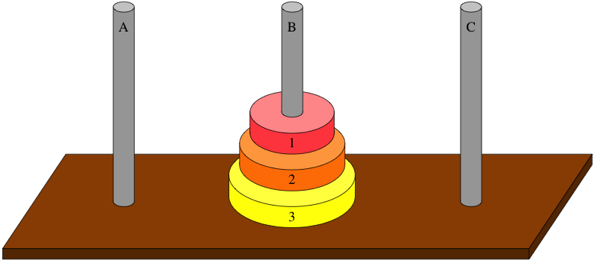

# Assignment 3

## Reading 

- Read Chapter 3 from the main book

## Implementation 

**Hanoi Tower Problem**

The Tower of Hanoi is a classic puzzle consisting of three pegs (towers) and a number of disks (donuts) of different sizes stacked in ascending order on one peg, with the largest disk at the bottom and the smallest at the top. The goal is to move the entire stack from the starting peg to another designated peg, following specific rules:

  - Only one disk can be moved at a time
  - Each move consists of taking the top disk from one peg and placing it on another peg
  - A larger disk can never be placed on top of a smaller disk

The challenge lies in completing the transfer with the minimum number of moves, which is mathematically proven to be $2^n-1$ moves for $n$ disks. The problem is often solved recursively by moving smaller stacks to an auxiliary peg, moving the largest disk, and then moving the smaller stacks onto the largest disk at the destination peg. 

Here is how this problem (sequential process of actions) when $n=3$ can be formulated as MDP:

- States $S$: Each state is a tuple $(d_1, d_2, d_3)$, where $d_i \in \{A, B, C\}$ indicates the peg where disk $i$ is located, with disk 1 smaller than disk 2, and so on. For example, $(A, A, B)$ means disk 1 and disk 2 on peg A, disk 3 on peg B, with the smallest disk numbered 1. The one in the picture is represented as $(B, B, B)$. The initial state is $(A, A, A)$.

- Actions $A$: correspond to moving the top disk from one peg to another peg legally (no placing a larger disk on a smaller disk). For example, $a_{31}$ moves the top disk from tower 3 to tower 1 (assume this is a valid action).

- Transition function $P$ is deterministic: For each action in a state, the resulting state is unique

- Reward function $R$

$$
R(s, a) = 
\begin{cases}
1 & \text{if } s' = (C, C, C) \text{ (goal state)} \\
0 & \text{otherwise}
\end{cases}
$$

- Naive policy $\pi$ is _always move the smallest disk to the next peg clockwise; if not possible, move the next legal disk_.

**Task** Compute the value function $v_\pi(s)$ for all states under the naive policy $\pi$ using:

$$v_\pi(s) = R(s, \pi(s)) + \gamma v_\pi(s')$$

where $s' =$ next state under policy $\pi$, and $\gamma = 1$. In this assignment, you need to provide the value function after only one iteration. 
