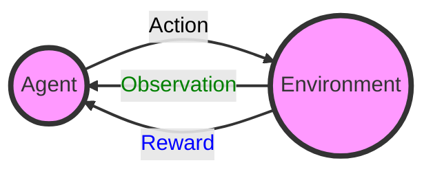

# Reinforcement Learning   (DSAI 402)
## Lecture 1

Mohamed Ghalwash
<Email v="mghalwash@zewailcity.edu.eg" />

---
transition: fade-out
layout: image-right
image: images/RL-bg.png
---

# What is Reinforcement Learning?

- Learning optimal decisions over time
- Machine learning vs RL 
- Supervised vs Unsupervised learning 

<BottomBar/>

---
layout: image-right
image: images/mouse_maze.png
---

**Robot mouse maze world**

<v-clicks>

- The environment is a maze containing food and electricity at certain locations 
- The robot mouse can perform actions as turning left or right and moving forward  
- The robot can observe the entire state of the maze to decide which action to take 
- Its goal is to collect as much food as possible while avoiding electric shocks whenever it can
- The food and electricity signals act as rewards provided by the environment
- _Suffer from a slight electric shock to reach an area with abundant food_ **OR** _standing and gaining nothing_

</v-clicks>

<BottomBar/>

---
layout: fact
---

## The agent’s ultimate goal is to maximize its total accumulated reward

<BottomBar/>

---
layout: top-title
---
:: title :: 
RL Objectives 

:: content :: 

- Learn methods that will allow our robot to learn on its own how to avoid electricity and gather as much food as possible
  - Reward is +ve when gather food, -ve from electric shocks, neutral otherwise. 
  - Relate reward to action, let the agent learns how to perform an action better

**Challenges in RL**

- No i.i.d assumption 
- Exploit and Explore 
- Delay between reward and action 

<BottomBar/>

---
layout: side-title
titlewidth: is-3
color: white
align: rm-lm
---

:: title :: 

:: content :: 

- Reward
- Agent 
- Observation 
- Environment 
- Actions 

<!-- :: note :: 

the term reinforcement comes from the fact that a reward obtained by an agent should reinforce its behavior in a positive or negative way -->

<BottomBar/>
---
layout: top-title 
---
:: title :: 

Markov (Reward) Process 

:: content :: 

- Markov Process 
  - states 
  - transition matrix 
- Markov Reward Process
  - states
  - transition matrix 
  - reward $G_t = R_{t+1} + \gamma R_{t+2} + \gamma^2 R_{t+3} + \ldots$
  - value $V(s) = E(G | S_t = s)$

<BottomBar/>
---
layout: center
class: text-center
---

# Learn More

[Slidev](https://sli.dev) · [Course Homepage](https://github.com/m-fakhry/DSAI-402-RL)
