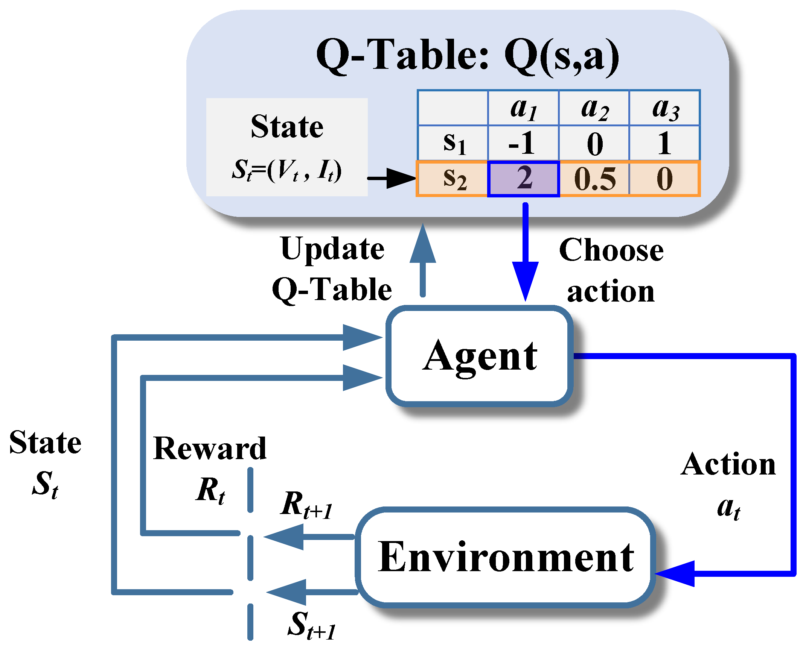
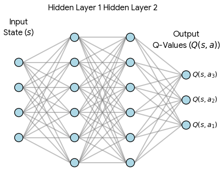
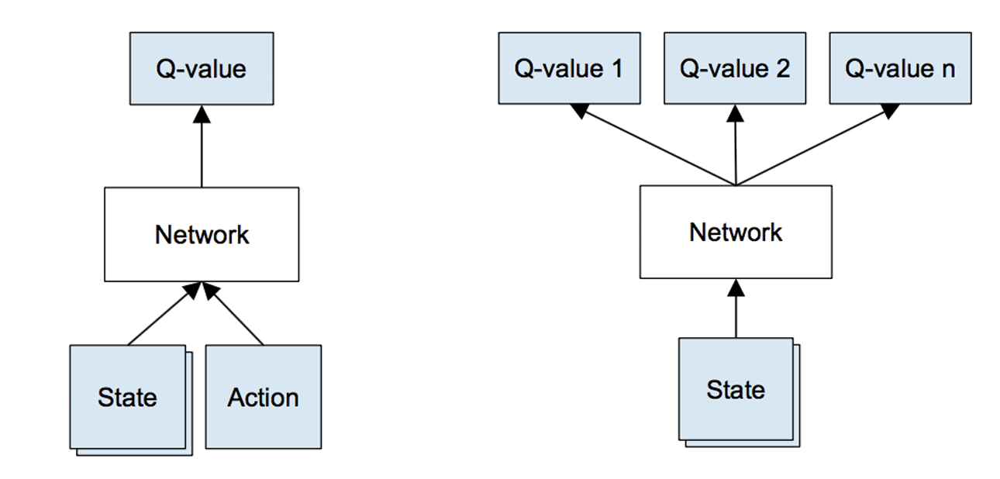
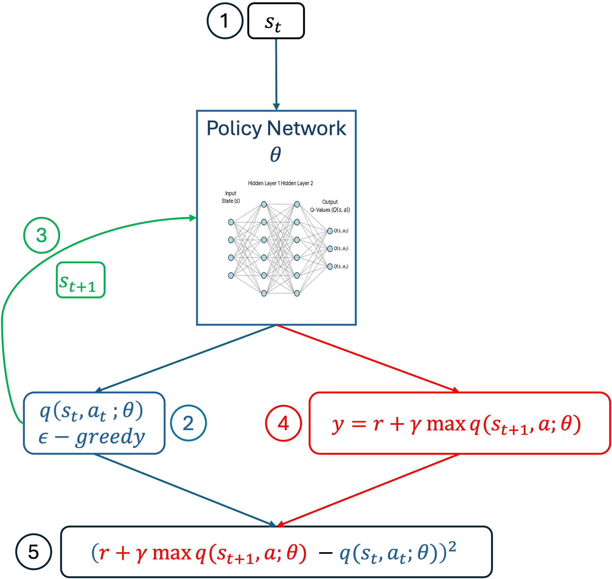
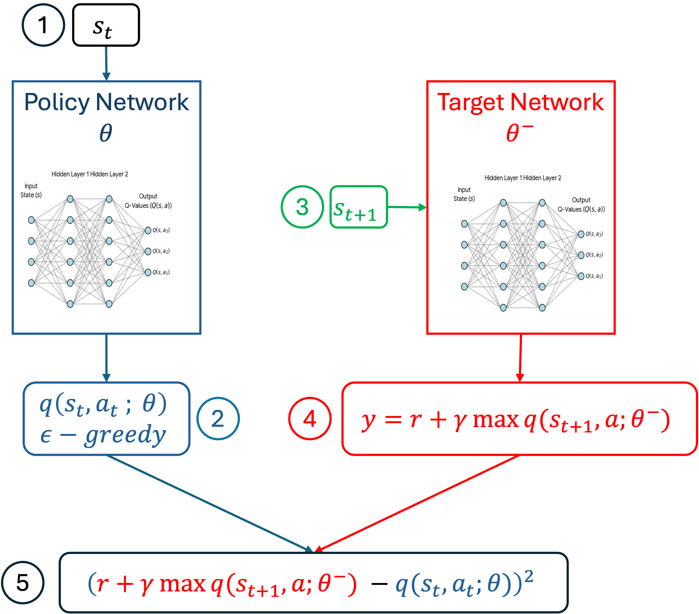
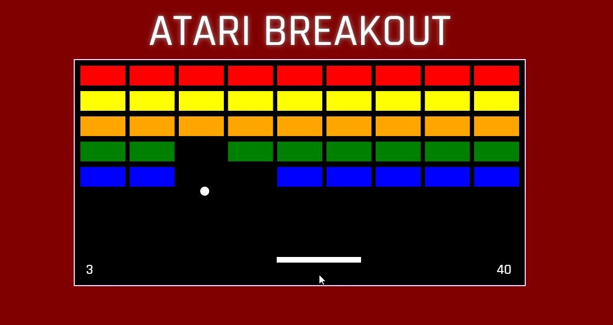

# Reinforcement Learning   (DSAI 402)
## Lecture 10

Mohamed Ghalwash
<Email v="mghalwash@zewailcity.edu.eg" />

---
layout: fact
---

# Recording is NOT allowed 

---
layout: top-title
---

:: title :: 

# Lecture 9 Recap

:: content :: 

- SARSA 
- Q Learning
  - $q(s_t, a_t) = q(s_t, a_t) + \alpha \left[ \textcolor{red}{r_{t+1} + \gamma \max_{a}q(s_{t+1}, a)} - \textcolor{blue}{q(s_t, a_t)} \right]$
  
    $\textcolor{red}{\text{target}}$ and $\textcolor{blue}{\text{current}}$ estimates
  
  - Q table 

  

--- 
layout: top-title 
--- 

:: title :: 

# The Problem with Q-Learning

:: content :: 

- Large state space for Q table
  - self-driving cars
  - network traffic control
  - images 
  
- Q-table becomes infeasible for high-dimensional inputs

--- 
layout: top-title 
--- 

:: title :: 

# Neural Network as Q-Function

:: content :: 

- Approximate the Q-function

  <!--  -->
  

$$Q(s, a; \textcolor{green}{\theta})$$

- Handles high-dimensional state spaces (e.g., images)

---
layout: cover 
---

## Human-Level Control Through Deep Reinforcement Learning
Mnih, Volodymyr, Koray Kavukcuoglu, David Silver, Andrei A. Rusu, Joel Veness, Marc G. Bellemare, Alex Graves et al.
Nature, 2015

_Cited by 38k papers 🤯_

--- 
layout: top-title 
--- 

:: title :: 

# DQN: Q-Learning with a Neural Network

:: content :: 

<Admonition title="TD Error" color='sky-light' width="500px" v-drag="[650,60,300,80,10]">

$\textcolor{red}{r_{t+1} + \gamma \max_{a}q(s_{t+1}, a)} - \textcolor{blue}{q(s_t, a_t)}$
</Admonition>

- The Q-value update is based on the Bellman equation

$$y_t = r_{t+1} + \gamma \; \max_{a} q(s_{t+1},a ; \theta)$$

- Regression task: the loss function minimizes the _[temporal difference (TD) error]{.decoration-4.underline.decoration-pink-500}_ using mean squared error

$$(\textcolor{red}{y_t} - \textcolor{blue}{q(s_t,a_t; \theta)})^2 $$
 
 
   where $\textcolor{blue}{q(s_t,a_t; \theta)}$ is the predicted Q-value and $\textcolor{red}{y_t}$ is the target Q-value

--- 
layout: top-title-two-cols
columns: is-4
--- 

:: title :: 

# DQN with One Neural Network

:: right :: 

  

:: left :: 

- The same weights $\theta$ are used to define both the [current prediction]{.bg-indigo-200} AND the [target]{.bg-red-200} value

- Targets depend on the network weights. This is in contrast with the targets used for supervised learning, which are fixed before learning begins

--- 
layout: top-title 
--- 

:: title :: 

# Issues in DQN with One Neural Network

:: content :: 

- When we train with a single network, we are trying to regress the current prediction $q(s_t, a_t; \theta)$ towards the target value $y_t$. However, notice that [the same weights]{.decoration-4.underline.decoration-pink-500} $\theta$ are used to define both the [current prediction]{.bg-indigo-200} AND the [target]{.bg-red-200} value

- Since the target $y_t$ is constantly shifting as the weights $\theta$ are updated in every training step, the network is never optimizing towards a stable goal
  
- This leads to oscillations and divergence (instability) during training, making it very difficult for the Q-values to converge correctly
- Targets depend on the network weights this is in contrast with the targets used for supervised learning, which are fixed before learning begins

--- 
layout: top-title-two-cols
columns: is-4 
--- 

:: title :: 

# Solution: Two Networks

:: left :: 

- **Policy network**: used to select the action in the environment, using $\epsilon$-greedy policy, and calculate the current q-value $q(s, a; \theta)$
  
- **Target network**: only used to calculate the stable target value $y$ 
  $$y = r + \gamma \max_{a} q(s, a; \theta^{-})$$

:: right :: 

  

---
layout: top-title
---

:: title :: 

# Update Target Every While

:: content :: 

- Update the target network $\theta^{-}$ every $C$ steps

<StickyNote color="amber-light" textAlign="center"  v-drag="[180,220,700,90]">

##### By introducing this temporal delay in the target calculation, DQN achieves the stability required for deep learning to converge effectively in a reinforcement learning setting

</StickyNote>

--- 
layout: top-title 
--- 

:: title :: 

# Issues

:: content :: 

- Hold the parameters from the previous iteration fixed $\theta_t^{-}$ when optimizing the $i^{th}$ loss function
  
- Correlation between successive samples (not IID)

- Small updates to $Q$ may significantly change the policy and data distribution

<v-click>

**Solution**: Experience replay to remove correlations in the observation
</v-click>

--- 
layout: top-title 
--- 

:: title :: 

# Experience Replay

:: content :: 

- A mechanism where the agent stores its experiences $(s_t, a_t, r_{t+1}, s_{t+1})$) in a large memory unit called the Replay Buffer (or Replay Memory)
  
- During training, the agent samples a random mini-batch of these past experiences to update the policy network

- Update the target network every $C$ steps

--- 
layout: top-title 
--- 

:: title :: 

# DQN

:: content :: 

- **Stability** 
  - The weights of the target network ($\theta^{-}$) are kept fixed for a set number of training steps ($C$)
  - This makes the target $y$ a stable, non-moving reference point for the Policy Network to chase
  
- **Decoupling**
  - The predicted value (which changes every step) is decoupled from the target value (which remains constant for $C$ steps)
- **Update Rule**
  - After $C$ steps, we simply copy the weights of the Policy Network to the Target Network: $\theta \rightarrow \theta^{-}$
  - The target is "refreshed" periodically, but not constantly

--- 
layout: top-title 
--- 

:: title :: 

# Full Algorithm

:: content :: 

1. **Initial Population**
  - The agent interacts with the environment for many initial steps using a random policy
  - Fill the Replay Buffer with a diverse collection of transitions across multiple episodes  $(s, a, r, s')$
2. **Training Phase** 
   - Sample a random mini-batch from the buffer $(s, a, r, s')$
   - Calculate target value $y$ using the frozen target network 
   - Calculate predicted $q$-value using the policy network 
   - Compute the loss and update the policy network 
3. **Update the target network**
   - For every $C$ steps, copy the policy network to the target network

--- 
layout: top-title 
--- 

:: title :: 

# Example: Atari Breakout

:: content :: 

- State: Stack of 4 grayscale frames
- Actions: Move paddle left, right, or do nothing
- Reward: +1 for each brick destroyed, -1 for losing the ball
- DQN learns to maximize cumulative reward by adjusting paddle movements

  

--- 
layout: top-title 
--- 

:: title :: 

# Summary

:: content ::

- DQN revolutionized RL by enabling agents to learn from high-dimensional inputs
- Key innovations: neural networks, target network, experience replay

---
layout: center
class: text-center
---

# Learn More

[Course Homepage](https://github.com/m-fakhry/DSAI-402-RL)

<!-- https://www.datacamp.com/tutorial/sarsa-reinforcement-learning-algorithm-in-python -->