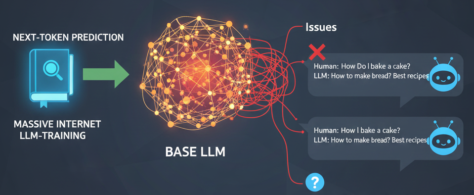
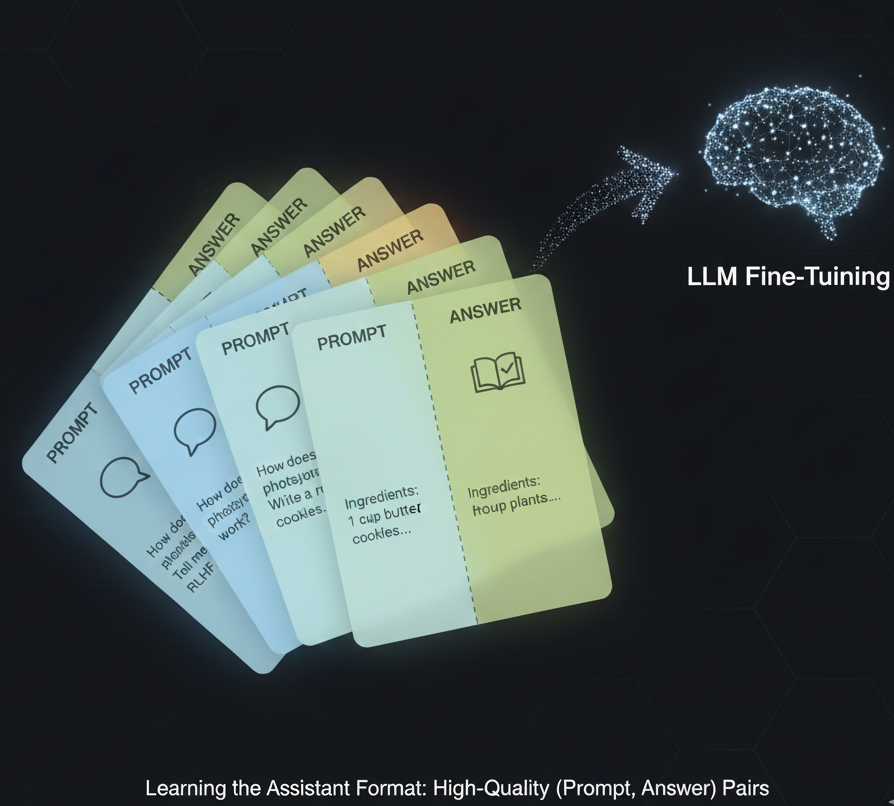
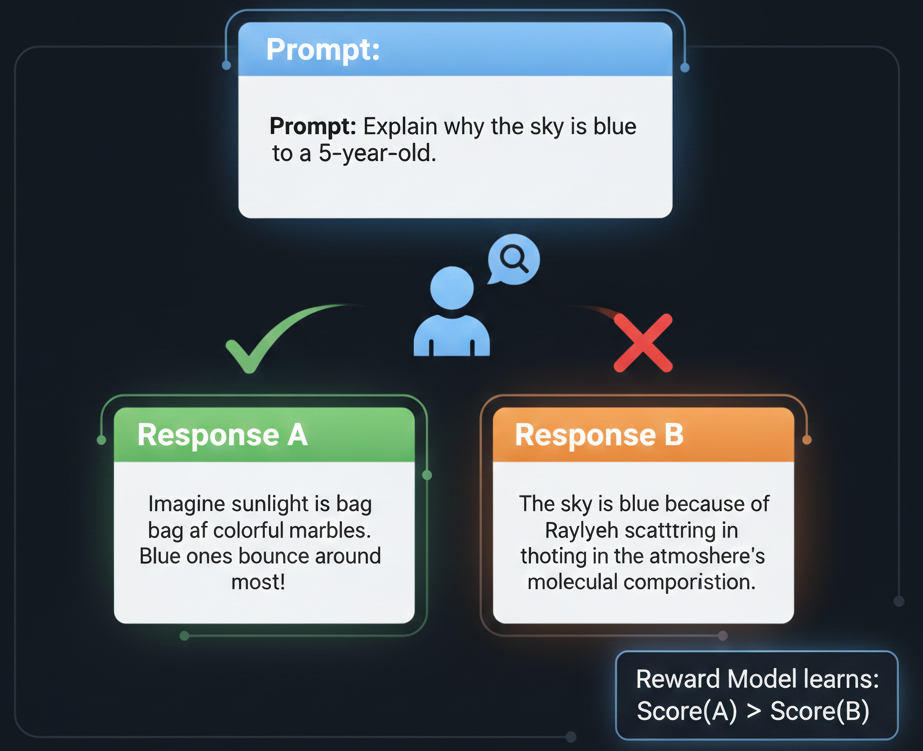
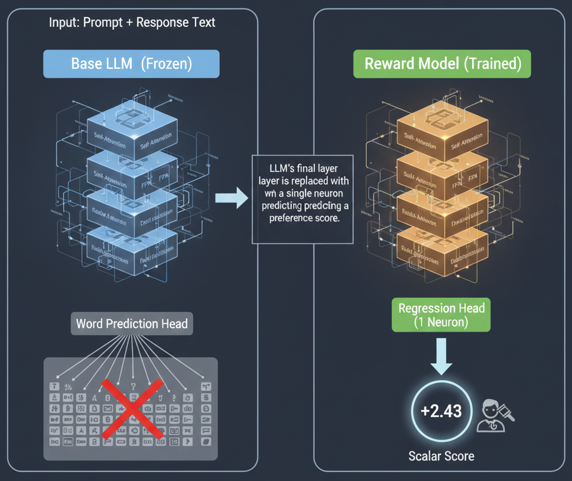
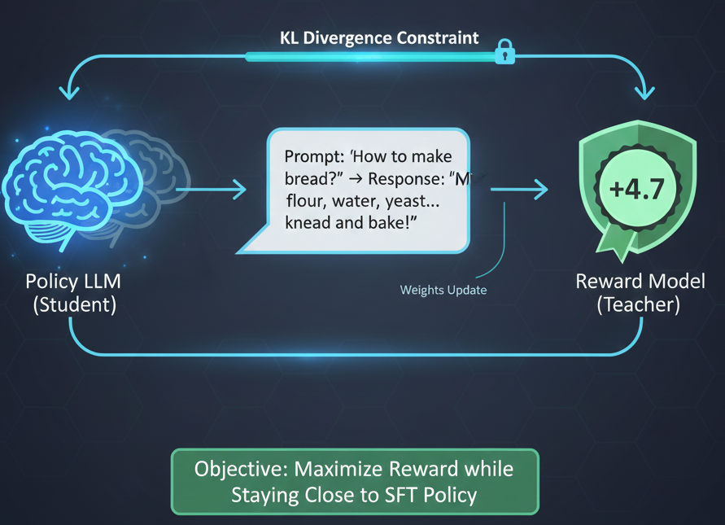
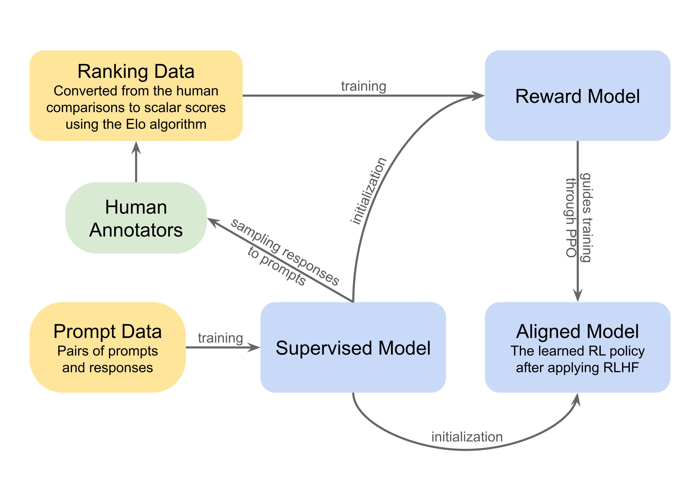

# Reinforcement Learning   (DSAI 402)
## Lecture 11

Mohamed Ghalwash
<Email v="mghalwash@zewailcity.edu.eg" />

---
layout: fact
---

# Recording is NOT allowed 

---
layout: top-title-two-cols
class: 
---

:: title :: 

# RL Recap

:: left :: 

- Markov Chain / Process (MP)
- Markov Reward Process (MRP)
- Markov Decision Process (MDP)
- Bellman Equation 
- Dynamic Programming 
  - Policy Iteration
  - Value Iteration 
- Monte Carlo 
  - Exploring starts 
  - $\epsilon$-greedy
  

:: right :: 

- Temporal Difference
  - TD(0)
  - $n$-step TD 
- SARSA (on-policy)
  - $n$-step SARSA
- Q Learning (off-policy)
- Deep Q-Learning 
- Applications of RL 

---
layout: cover
---

# RL in Healthcare

---
layout: top-title 
---

:: title ::

# RL in Healthcare

:: content :: 

### Optimize sequential treatment strategies

- Recommend optimal dosages of intravenous fluids and vasopressors
  - States: demographic, vital signs, lab values, fluids, etc. 
  - Actions: oxygen, pressure, Volume of air 
  - Reward: +1 for survival, -1 for passing away, Apache Score (intermediate scores)
  

- Optimize personalized dosing for insulin management for type 1
- Optimize the allocation and distribution of ICU beds

_Kondrup, Flemming, et al. "Towards safe mechanical ventilation treatment using deep offline reinforcement learning." Proceedings of the AAAI Conference on Artificial Intelligence. Vol. 37. No. 13. 2023._

---
layout: cover
---

# RL in Chatbot

---
layout: top-title 
---

:: title ::

# RL in Chatbot

:: content :: 

- LLM is trained on a huge corpus ... but it just a similarity-based model 
- **Issues**: non-sense answers in QA applications 

  

- **Solution**: Supervised fine tuning 

---
layout: top-title-two-cols 
columns: is-8
align: l-lt-lt
---

:: title ::

# Learning to Answer: Supervised Fine Tuning (SFT)

:: right :: 

  

:: left :: 

- **Objectives**: LLM learns the QA format
- **Data**: A curated set of (Prompt + Answer) pairs ... Human annotations 

- Fine **Tuning** LLM 
  - All layers (Embeddings, Norms, Attention, FFN)
  - Heads 
  - LORA

- **Issues**: the quality of the answers 

---
layout: top-title-two-cols 
columns: is-8
align: l-lt-lt
---

:: title ::

# Learning to Behave: Human Feedback 

:: right :: 

  

:: left :: 

- **Objectives**: Teach what humans prefer (quality of the answers)
- **Data**: 
  - Human generates multiple answers and labels which one it prefers
  - Can we ask LLM to generates different answers for the same question and human labels them? 
    

---
layout: top-title-two-cols 
columns: is-4
align: l-lt-lt
---

:: title ::

# Learning to Behave: Reward Model

:: right :: 

  

:: left :: 

- Replace the last layer of LLM (word prediction layer) with a 
regression layer (one scalar value) 
- Pairwise ranking loss 
  $$R(g)> R(b)$$
- Reward model only respond at the end unlike LLM predicts word-by-word 
  
---
layout: top-title 
---

:: title ::

# RL Optimization: The PPO Training Loop

:: content :: 

- **Objectives**: The SFT Model (Student) practices by answering prompts while the Reward Model (Teacher) grades them

- Loop
  - Generate a random prompt $\rightarrow$ LLM generates the response 
  - Evaluate: glue prompt and answer $\rightarrow$ reward model scores it
  - Proximal Policy Optimization (PPO) Strategy 
    - high score $\rightarrow$ LLM adjusts its weights to make that kind of response more likely in the future
    - low score $\rightarrow$ LLM makes that response less likely
- **Safety Mechanism**: A KL Divergence penalty tis used o make sure the model doesn't drift too far from its original SFT version and start babbling nonsense just to "trick" the reward model (Reward Hacking)

---
layout: top-title 
---

:: title ::

# PPO Training Loop

:: content :: 

  

---
layout: top-title 
---

:: title ::

# RLHF: Reinforcement Learning from Human Feedback

:: content :: 

  

---
layout: top-title 
---

:: title ::

# Direct Preference Model (DPO)

:: content :: 

- **Issue**: Training multiple models and complexity of PPO
  - SFT (student)
  - Reward (teacher) 
  - KL Divergence 
  - Value model PPO 
- DPO (Stanford, 2023)
  - In RLHF: Humans rank data $\rightarrow$ Train Reward Model $\rightarrow$ Reward Model trains LLM.
  - In DPO: Humans rank data $\rightarrow$ Train LLM directly on those rankings.
  - Contrastive loss (prompt, preferred answer, rejected answer)

---
layout: center
class: text-center
---

# Learn More

[Course Homepage](https://github.com/m-fakhry/DSAI-402-RL)

---
layout: full
---

  

---
layout: credits
color: light
speed: 1.0
loop: True
---

  Thanks to all Game Players

  <strong>Cast</strong>  
  (in alphabetical order)

<strong>RL TAs</strong>

Mohamed Talaat <mdi-open-in-new class="font-size-3 mb-0.5" /> 
Osama Ghandour <mdi-open-in-new class="font-size-3 mb-0.5" /> 
Yousef Elbaz <mdi-open-in-new class="font-size-3 mb-0.5" /> 

<strong>SR TAs</strong>

Ahmed Aamer <mdi-open-in-new class="font-size-3 mb-0.5" /> 
Aya Nageh <mdi-open-in-new class="font-size-3 mb-0.5" /> 
Ossam Ghandour <mdi-open-in-new class="font-size-3 mb-0.5" /> 

<strong>Players</strong>

All students

<strong>Course Instructor</strong>

Dr. Mohamed Ghalwash

