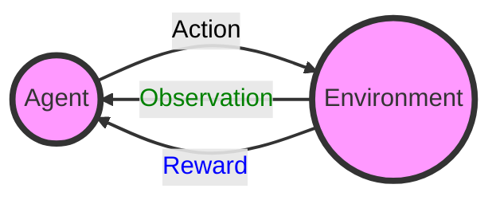

# Reinforcement Learning   (DSAI 402)
## Lecture 2

Mohamed Ghalwash
<Email v="mghalwash@zewailcity.edu.eg" />

---
transition: fade-out
layout: top-title
class: ns-c-center-item
---

:: title :: 

# Lecture 1 Recap

:: content :: 

- RL definition (environment, action, reward, observation)
- Challenges in RL
- Into for Markov Process 

<BottomBar/>

---
layout: top-title
# image: images/mouse_maze.png
---

:: title :: 

# Markov Process 

:: content :: 

- States 
- Transition matrix $P$
- Markov Property: $P(S_t|S_{t-1},S_{t-2},\ldots,S_1) = P(S_t|S_{t-1})$

  
Examples:

- Weather `S R S S S R R R S R `

- Currency Exchange Rate 
  
   

- What does it mean $P^2$? 
  
<BottomBar/>

---
layout: top-title
# image: images/mouse_maze.png
---

:: title :: 

# Markov Reward Process 

:: content :: 

- States: $S$
- Transition matrix: $P$ _source $\rightarrow$ target_
- Accumulated Reward: $G_t = R_{t+1} + \gamma R_{t+2} + \gamma^2 R_{t+3} + \ldots$
- Markov property: $P(R_t, S_t|S_{t-1},S_{t-2},\ldots,S_1) = P(R_t, S_t|S_{t-1})$
- Value function: $V(s) = E(G | S_t = s)$

     
Examples 
- Cat moving through rooms 

<BottomBar/>

---
layout: center
class: text-center
---

# Learn More

[Slidev](https://sli.dev) · [Course Homepage](https://github.com/m-fakhry/DSAI-402-RL)
