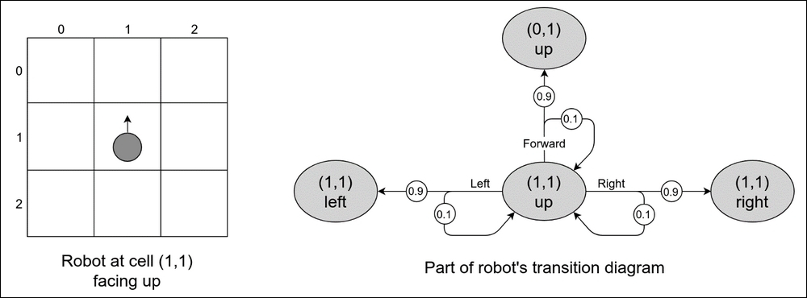
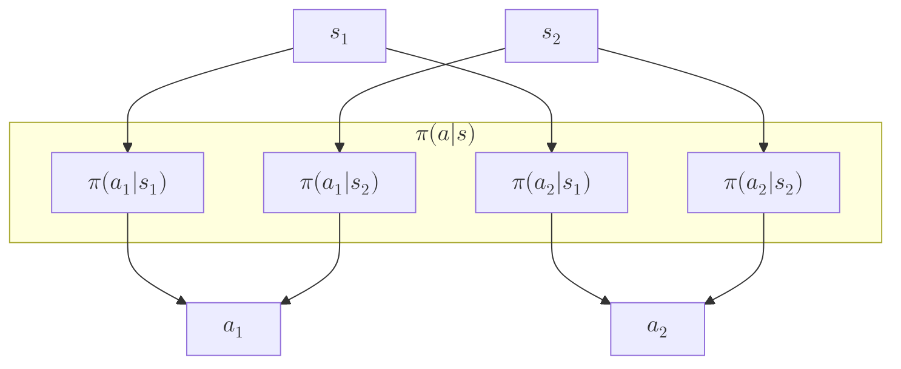
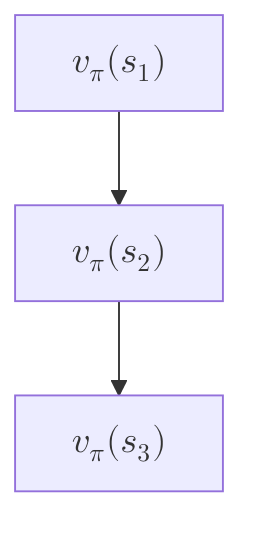
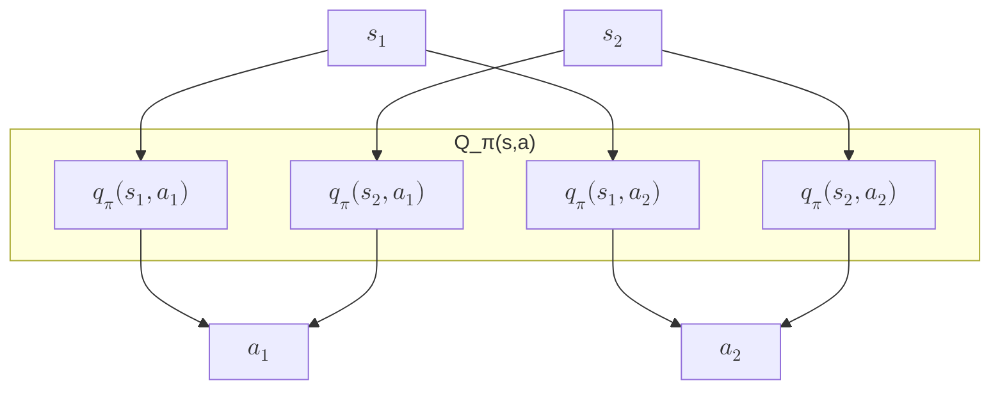
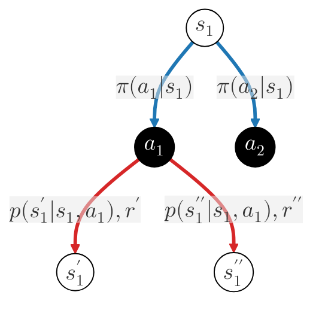

# Reinforcement Learning   (DSAI 402)
## Lecture 3

Mohamed Ghalwash
<Email v="mghalwash@zewailcity.edu.eg" />

---
transition: fade-out
layout: top-title
class: ns-c-center-item
---

:: title :: 

# Lecture 2 Recap

:: content :: 

- Markov Process
  - Multiple chains 
  - Rolling average 
  
- Markov Reward Process
  - Accumulated (==discounted==) reward, $G_t = R_{t+1} + \gamma G_{t+1}$
  - Value function $v(s)$ = expected accumulated reward
    - How good it is for the agent to be in a given state
    - Monte Carlo: involve averaging over many random samples of actual returns
  
<BottomBar/>

---
layout: top-title
---

:: title :: 

# Markov Decision Process

:: content :: 

- Markov Reward Process + Actions
- Transition matrix: $P$ (_source and ==action==_) $\rightarrow$ (_target_)
- Markov: probabilistic move $P(R_t, S_t|S_{t-1},A_{t-1})$, i.e. $p(s^\prime | s,a)$, $r(s,a,s^\prime)$
  

  

<BottomBar/>

---
layout: top-title
# columns: is-10
# align: l-lt-ct
---

:: title :: 

# What is Policy?

:: content :: 

- $\pi(a|s)$
  - a mapping from states to probabilities of selecting each possible action

<BottomBar/>

---
layout: top-title
# columns: is-10
# align: l-lt-ct
---

:: title :: 

# What is Policy?

:: content :: 

- $v_{\pi}(s)$
  - the state-value function of a state $s$ under a policy $\pi$
  - the expected return when starting in $s$ and following $\pi$ thereafter

<BottomBar/>

---
layout: top-title
---

:: title :: 

# What is Policy?

:: content :: 

- $q_{\pi}(s, a)$
  - the action-value function of taking action $a$ in state $s$ under a policy $\pi$ 
  - the expected return when performing action $a$ in state $s$ and following $\pi$ thereafter

<BottomBar/>

---
layout: top-title
columns: is-1-11
class: text-center
---

:: title ::

# Bellman

:: content :: 

  

$$
{1|1,2|2,3|3,4|4,5|all}
\begin{array}{ll}
v_\pi(s) & = \mathbb{E}_\pi \left[ G_t \mid S_t = s \right] \\ \\
        & =  \mathbb{E}_\pi \left[ \textcolor{green}{R_{t+1} + \gamma G_{t+1}} \mid s \right] \\ \\
        & =  \mathbb{E}_\pi \left[ \textcolor{green}{R_{t+1} + \gamma v_\pi(s^\prime)} \mid s \right] \\ \\
        & = \sum_a \sum_{s^\prime} \textcolor{blue}{\pi(a|s)} \textcolor{red}{p(s^\prime|s,a)} \left[ \textcolor{green}{r(s,a,s^\prime) + \gamma v_\pi(s^\prime)} \right] \\ \\ 
        & = \sum_a \textcolor{blue}{\pi(a|s)} \sum_{s^\prime} \textcolor{red}{p(s^\prime|s,a)} \left[ \textcolor{green}{r(s,a,s^\prime) + \gamma v_\pi(s^\prime)} \right]
\end{array}
$$

  

  

  

<v-click>

#### For each ==state-action-next state== triple, we calculate the joint probability $\textcolor{blue}{\pi(a|s)}\textcolor{red}{p(s^\prime|s, a)}$ and use it to weight the expected reward. Summing over all such triples yields the total expected state-value

</v-click>

<BottomBar/>

---
layout: top-title
columns: is-1-11
class: text-center
---

:: title ::

# Bellman

:: content :: 

  

$$
{1|2|all}
\begin{array}{ll}
q_\pi(s, a) 
         & =  \mathbb{E}_\pi \left[ R_{t+1} + \gamma q_\pi(s^\prime, a^{\prime}) \mid s, a \right] \\ \\
         & = \sum_{s^\prime} p(s^\prime|s,a) \left[ r(s,a,s^\prime) + \gamma \sum_{a^\prime} \pi(a^\prime \mid s^\prime) q_{\pi}(s^\prime, a^\prime) \right]
\end{array}
$$

  

  

  

<BottomBar/>

---
layout: top-title
---

:: title :: 

# Optimal Policy

:: content :: 

- For finite MDPs, we can precisely define an optimal policy in the following way.
A policy $\pi$ is defined to be better than or equal to a policy $\pi^\prime$ if its expected return is greater than or equal to that of $\pi^\prime$ for all states.
In other words, $\pi >= \pi^\prime$ if and only if $v_{\pi}(s) >= v_{pi^\prime}(s)$ for all $s \in S$

- There is always at least one policy that is better than or equal to all other policies. This is an optimal policy

$v_{*}(s) := max_\pi \; v_\pi(s)$

$q_{*}(s, a) := max_\pi \; q_\pi(s, a)$

<BottomBar/>

---
layout: fact
---

## A policy is a stochastic rule by which the agent selects actions as a function of states. The agent’s objective is to maximize the amount of reward it receives over time.

<BottomBar/>

---
layout: center
class: text-center
---

# Learn More

[Slidev](https://sli.dev) · [Course Homepage](https://github.com/m-fakhry/DSAI-402-RL)