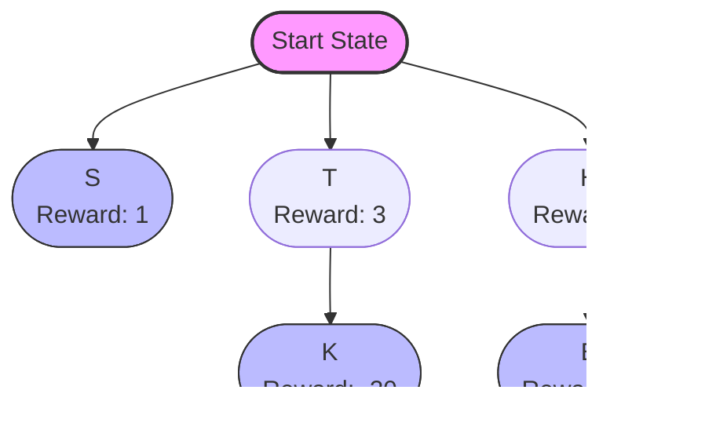

# Reinforcement Learning <br> (DSAI 402)
## Lecture 4

Mohamed Ghalwash
<Email v="mghalwash@zewailcity.edu.eg" />

---
transition: fade-out
layout: top-title
class: ns-c-center-item
---

:: title :: 

# Lecture 3 Recap

:: content :: 

- Markov Decision Process
  - Accumulated (==discounted==) reward, $G_t = R_{t+1} + \gamma G_{t+1}$
  - State-value function $v(s)$
  - Action-value function $q(a,s)$
  
<BottomBar/>

---
layout: top-title-two-cols
columns: is-8
align: l-lt-lm
---

:: title :: 

# Value Functions (Bellman)

:: left :: 


$$
{all}
\begin{array}{ll}
v_\pi(s) & = \sum_a \textcolor{blue}{\pi(a|s)} \sum_{s^\prime} \textcolor{red}{p(s^\prime|s,a)} \left[ \textcolor{green}{r(s,a,s^\prime) + \gamma v_\pi(s^\prime)} \right]
\end{array}
$$

<br/> 

$$
{0|1|2|all}
\begin{array}{ll}
q_\pi(s, a) 
         & =  \mathbb{E}_\pi \left[ R_{t+1} + \gamma v_\pi(s^\prime) \mid s, a \right] \\ \\
         & = \sum_{s^\prime} \textcolor{red}{p(s^\prime|s,a)} \left[ r(s,a,s^\prime) + \gamma \textcolor{green}{v_\pi(s^\prime)} \right]
\end{array}
$$

<br/><br/>

$$
{0|all}
\begin{array}{ll}
v_\pi(s) 
        & = \sum_a \textcolor{blue}{\pi(a|s)} \sum_{s^\prime} \textcolor{red}{p(s^\prime|s,a)} \left[ \textcolor{green}{r(s,a,s^\prime) + \gamma v_\pi(s^\prime)} \right] \\ \\ 
        & = \sum_a \textcolor{blue}{\pi(a|s)} q_\pi(s, a) 
\end{array}
$$

:: right :: 


<BottomBar/>

---
layout: top-title
---

:: title :: 

# Optimal Policy

:: content :: 


A policy $\pi^\prime$ is defined to be better than or equal to a policy $\pi$ if its expected return is greater than or equal to that of $\pi$ for all states.

<div style="text-align:center;">

$\pi^\prime >= \pi$ if and only if $v_{\pi^\prime}(s) >= v_{\pi}(s)$ for all $s \in S$

</div>

<br/><br/><br/>

There is always at least one policy that is better than or equal to all other policies. This is an optimal policy

<div style="text-align:center;">

$v_{*}(s) := max_\pi \; v_\pi(s)$

$q_{*}(s, a) := max_\pi \; q_\pi(s, a)$

</div> 

<BottomBar/>

---
layout: statement
---

## A policy is a stochastic rule by which the agent selects actions as a function of states. The agent’s objective is to maximize the amount of reward it receives over time.

<BottomBar/>

---
layout: top-title
---

:: title :: 

# Example: Vending Machine

:: content :: 

Imagine an agent deciding which button (A, B, C) to press on a vending machine:
<!-- <div class="ns-c-tight"> -->

- **States** represent the machine’s current configuration (e.g., no selection made yet)
- **Actions**: pressing one of three buttons: A -> Biscoff, B -> Doritos, C -> Galaxy
- **Rewards**: based on the tastiness of each snack: Biscoff= 1, Doritos = 2, and Galaxy = 3
- The environment is deterministic: pressing a button always results in receiving the corresponding snack and episode ends
<!-- </div>  -->


<!-- style="display: grid; grid-auto-flow: column; place-items: center;" -->
<div class="grid place-items-center grid-cols-3" >
  
  <div v-click="1" class="col-span-1">


  </div>

  <div v-click="2" class="col-span-2"> 

  <v-clicks>

  - [What is really missing from the formulation?]{.bg-red-200}

  - [Poilcy]{.bg-indigo-200} $\pi ( a | s )$

  - $\pi ( a = A | s ) = 0.2$, $\pi ( a = B | s ) = 0.3$, $\pi ( a = C | s ) = 0.5$

  </v-clicks>

  </div>

</div>


<BottomBar/>

---
layout: top-title
---

:: title :: 

# Example: Vending Machine

:: content :: 

<div class="text-align-center" >


</div> 

What is the value of the start state $v_\pi(s)$?

<v-clicks> 

- $\pi ( a = A | s ) = 0.2$, $\pi ( a = B | s ) = 0.3$, $\pi ( a = C | s ) = 0.5$
  - $v_\pi(s) = 0.2 * 1 + 0.3 * 2 + 0.5 * 3 =$ ==$2.3$==

- $\pi ( a = A | s ) = 1$, $\pi ( a = B | s ) = 0$, $\pi ( a = C | s ) = 0$
  - $v_\pi(s) = 1 * 1 + 0 * 2 + 0 * 3 =$  ==$1$==

- $\pi ( a = A | s ) = 0$, $\pi ( a = B | s ) = 0$, $\pi ( a = C | s ) = 1$
  - $v_\pi(s) = 0 * 1 + 0 * 2 + 1 * 3 =$ ==$3$==

</v-clicks>

<v-click>

<SpeechBubble position="l" color='rose-light' shape="round"  v-drag="[600,350,200,80]">
Which policy is the optimal one? 
</SpeechBubble>

</v-click> 

<BottomBar/>

---
layout: top-title
---

:: title :: 

# Example: Not Greedy

:: content :: 

<div class="text-align-center" >


</div> 


<BottomBar/>

---
layout: section
--- 

# Dynamic Programming 

<BottomBar/>

---
layout: top-title 
---

:: title :: 

# Policy Evaluation 

:: content :: 

- The existence and uniqueness of $v_\pi$ are guaranteed as long as either $\gamma < 1$

- Iterative policy evaluation: the sequence $\{v_k\}$  can be shown in general to converge to $v_\pi$  as $k\rightarrow \infty$

- Expected update: two arrays or one array (in place)

```python {1|2|3|4|5,6|7,8,9|7,8,9,10|11,12|all}
function iterative_policy_evaluation() {
    v = {s: 0 for s in env.states}
    while True:
        for s in env.states:
            old_v[s] = v[s]
            new_v[s] = 0
            for a in policy[s]:
                for s_ , r, prob in env.transitions(s, a):
                    new_v[s] += policy[s][a] * prob * (r + gamma * v[s_])
            v[s] = new_v[s]
        if max(abs(old_v - v[s])) < theta:
            break
    return v
}
```

<SpeechBubble style="font-family: 'Arial', sans-serif; font-size: 12px;" position="l" color='fuchsia-light' shape="round"  v-drag="[600,320,300,60]" class="custom-angle" animation="float" v-click="5" v-click.hide="6">

$v_\pi(s) = \sum_a \pi(a|s) \sum_{s^\prime} p(s^\prime|s,a) \left[ r(s,a,s^\prime) + \gamma v_\pi(s^\prime) \right]$

</SpeechBubble>


<BottomBar/>

---
layout: top-title-two-cols
columns: is-8
align: l-lt-lm
---

:: title :: 

# Policy Improvement

:: left :: 

- For ==some state $s$== we would like to know whether or not we should change the policy to deterministically choose an action ==$a\neq \pi(s)$==
<!-- - Consider selecting $a \neq \pi(s)$ and thereafter following the existing policy $\pi$. -->

$$
{all}
\begin{array}{ll}
q_\pi(s, a) 
         & =  \mathbb{E}_\pi \left[ R_{t+1} + \gamma v_\pi(s^\prime) \mid s, a \right] \\ \\
         & = \sum_{s^\prime} p(s^\prime|s,a) \left[ r(s,a,s^\prime) + \gamma v_\pi(s^\prime) \right]
\end{array}
$$

<!-- - if $q_\pi(s, a) > v_\pi(s)$ then it is better to select $a$ once in $s$ and thereafter follow $\pi$ -->

- $q_\pi(s, \pi^\prime(s)) > v_\pi(s) \;\; \Rightarrow \;\; v_{\pi^\prime} (s) \geq v_\pi(s)$

<!-- - Let $\pi$ and $\pi^\prime$ be any pair of deterministic policies such that -->

<!-- $$q_\pi(s, \pi^\prime(s)) \geq  v_\pi(s), \;\;\;\;\;\;\; s.t. \;\;\; \pi^\prime(s) \neq \pi(s) \text{ for some }s $$ -->


$\Rightarrow$ the policy $\pi^\prime$ must be as good as or better than $\pi$ 

- Then we can obtain a new policy as 
  
$$
\pi^\prime(s) \triangleq \underset{a}{\mathop{\mathrm{argmax}}} \;\; q_\pi(s, a)
$$

:: right :: 

```python {1|2|3|4,5,6,7|8,9|all}
function policy_improvement() {
    for s in env.states:
        old_action = policy[s]
        for a in policy[s]:
            q[a] = 0 
            for s_ , r, prob in env.transitions(s, a):
                q[a] +=  prob * (r + gamma * v[s_])
        new_action = argmax(q)
        policy[s] = a
    return policy
}
```

<BottomBar/>

---
layout: top-title 
---
:: title :: 

# Policy Iteration  

:: content :: 

- Computes an optimal by performing a sequence of interleaved policy evaluations and improvements
  

```python
function policy_iteration() {
    random policy 
    random v
    while True: 
      policy_evaluation() # compute v for each s
      policy_improvement() # choose best action for each s
}
```

<BottomBar/>


---
layout: top-title
---

:: title :: 

# Example $4\times 4$ grid world

:: content :: 

- Undiscounted and episodic task (shaded boxes are terminals)


<BottomBar/>

---
layout: top-title-two-cols
align: l-lm-lb
---

:: title :: 

# Example 

:: left :: 

{width=100%}

:: right :: 

<v-click>

{width=100%}

</v-click>

<BottomBar/>

---
layout: center
class: text-center
---

# Learn More

[Course Homepage](https://github.com/m-fakhry/DSAI-402-RL)
