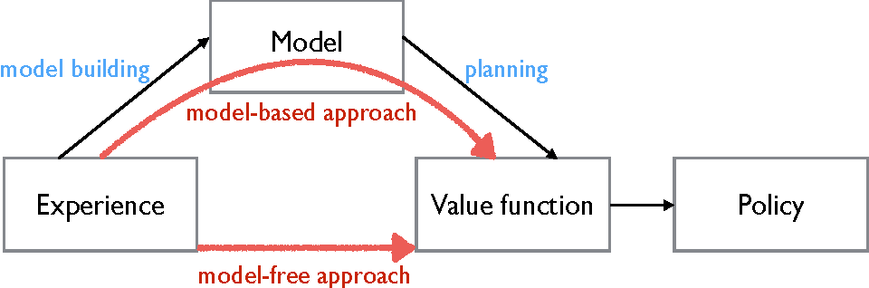

# Reinforcement Learning <br> (DSAI 402)
## Lecture 5

Mohamed Ghalwash
<Email v="mghalwash@zewailcity.edu.eg" />

---
transition: fade-out
layout: top-title
class: ns-c-center-item
---

:: title :: 

# Lecture 4 Recap

:: content :: 

- **Policy Iteration**
  
  1. **Policy evaluation**
       - Initialize $v_\pi(s) \;\;\; \forall s \in S$
       - Update $v_\pi(s)$ using Bellman $v_\pi(s)  = \sum_a \pi(a|s) \sum_{s^\prime} p(s^\prime|s,a) \left[ r(s,a,s^\prime) + \gamma v_\pi(s^\prime) \right]$

  2. **Policy Improvement**
       - for all $a \notin \pi(s)$ 
         - compute $q_\pi(s, a)  = \sum_{s^\prime} p(s^\prime|s,a) \left[ r(s,a,s^\prime) + \gamma v_\pi(s^\prime) \right]$
         - Update $v_{\pi^\prime} (s) = v_\pi(s)$ if $q_\pi(s, \pi^\prime(s)) > v_\pi(s)$ 


---
layout: top-title 
---

:: title :: 

# Value Iteration 

:: content :: 


- Iteratively updating a value function that estimates the expected long-term reward for each state

- Calculates the value of a state as the maximum expected reward by choosing the best action

$$
v_\pi(s)  = \max_a \sum_{s^\prime} p(s^\prime|s,a) \left[ r(s,a,s^\prime) + \gamma v_\pi(s^\prime) \right]
$$

```python {0|1,2,3|4,5|6,7,8|6,7,8,9|10,11|all}
function value_iteration() {
    v = {s: 0 for s in env.states}
    while True:
        for s in env.states:
            q_s[a] = {0 for a in policy[s]}
            for a in policy[s]:
                for s_ , r, prob in env.transitions(s, a):
                    q_s[a] +=  prob * (r + gamma * v[s_])
            v[s] = max q_s[a]
        if converge:
            break
    return v
}
```

---
layout: top-title 
---

:: title :: 

# Value Iteration 

:: content :: 

- Once the value function converges, the optimal policy is derived by selecting for each state the action that maximizes this value
$$
\pi(s)  = \argmax_a \sum_{s^\prime} p(s^\prime|s,a) \left[ r(s,a,s^\prime) + \gamma v_\pi(s^\prime) \right]
$$
- The value iteration update is identical to the policy evaluation update except that ==it requires the maximum to be taken over all actions==
- Value iteration converges to the optimal value function
- A policy can be defined as: _in a state $s$, choose the action with the highest expected reward_

---
layout: top-title
---

:: title :: 

# Issues in Policy- and Value- Iteration Algorithms

:: content :: 

- Robots operating in **unknown** or **constantly changing** environments must learn optimal behaviors by directly interacting with the environment without prior information about how actions affect state transitions or rewards

- Financial markets are notoriously difficult to model accurately because their dynamics are highly complex, random, and **continuously fluctuating**

- In healthcare, the administration of fluids and adjustment of medication dosages for sepsis patients is dynamically managed in real time, using ongoing patient data to improve survival outcomes
  
- These scenarios depend on learning through **trial and error** to enhance performance since it is impractical or impossible to fully model every possible outcome and state in advance

<br/>
<div class="text-center">

==These returns are actual observed rewards collected through direct interaction, not computed using a model== 
</div>

---
layout: section
color: blue-light
---

# Model-Free
<hr>

---
layout: side-title
align: rm-lt
titlewidth: is-2
color: blue-light
---

:: title :: 

# Model-Free Methods 

:: content :: 

- Methods without using a model for the environment 
- Learn through _experience_ 
- Learn association between actions and return (cumulated reward)

{margin:auto}

---
layout: center
class: text-center
---

# Learn More

[Course Homepage](https://github.com/m-fakhry/DSAI-402-RL)
