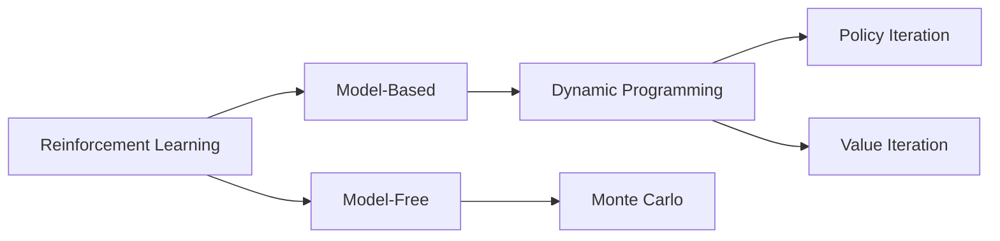

# Reinforcement Learning <br> (DSAI 402)
## Lecture 6

Mohamed Ghalwash
<Email v="mghalwash@zewailcity.edu.eg" />

---
transition: fade-out
layout: top-title
class: ns-c-center-item
---

:: title :: 

# Lecture 5 Recap

:: content :: 

---
layout: top-title
---

:: title ::

# Model-free vs Model-based

:: content :: 

<br/><br/>




---
layout: top-title
---

:: title ::

# Model-free vs Model-based

:: content :: 

<div class="grid grid-cols-2 gap-4 w-full">
  <div>

# Model-based
  - Requires knowledge of the environment’s model (<em>transition and reward</em>) to evaluate and improve a policy systematically
  - Computes the value function using the known transition probabilities and reward function to solve the Bellman equations
  </div>
  <div>

# Model-Free
  - Methods without a model; they learn association between action and return
  - Approximates these expectations by averaging observed returns from sampled experience, not by using the transition matrix or reward model
  </div>
  <div class="col-span-2 text-center">


  </div>
</div>

---
layout: top-title 
---

:: title ::

# Monte Carlo Method

:: content :: 

- How to compute the value function [without knowing the model]{.decoration-4.underline.decoration-pink-500}?
  
$$
\sum_{s^\prime} p(s^\prime|s,a) \left[ r(s,a,s^\prime) + \gamma v_\pi(s^\prime) \right]
$$

- Requires only [experience]{.decoration-4.underline.decoration-indigo-500} — sample ==sequences of states, actions, and rewards== from actual or simulated interaction with an environment
- Estimates $q_\pi$ from [samples]{.bg-sky-200} under the policy $\pi$
- Relies on empirical returns from sampled episodes rather than explicit transition probabilities or reward models
- Averages returns for each state–action pair


---
layout: top-title 
---

:: title ::

# Monte Carlo Prediction

:: content :: 

- learning the state-value function

```python{1,2,3|6,7|9|10,11|12,13|14,15,16|all}
# Initialize value function V arbitrarily (e.g., all zeros)
V = defaultdict(float)
Returns = defaultdict(list)  # stores returns for each state

# Repeat for each episode
for episode in range(num_episodes):
    episode_data = generate_episode(policy)  # generates [(state, reward), ...]

    G = 0  # return
    # Calculate the return G for each state in episode backwards
    for t in reversed(range(len(episode_data))):
        state, reward = episode_data[t]
        G = gamma * G + reward
        if state not in [x[0] for x in episode_data[:t]]:  # first visit check
            Returns[state].append(G)
            V[state] = sum(Returns[state]) / len(Returns[state])
```


---
layout: top-title
---

:: title :: 

# Monte Carlo Example 

:: content :: 

<div class ="ns-c-tight">

- episode 1 = $S_0, 2, S_1, 5, S_0, 3, S_2, 1$
- episode 2 = $S_1, 4, S_0, 1, S_2, 3$
- episode 3 = $S_0, 4, S_0, 1, S_1, 2, S_0, 1, S_2, 2$

</div>

Assume $\gamma=1$ 


---
layout: default
---


|    |        |        |        |        |        |
|----|--------|--------|--------|--------|--------|
| Episode 1 | $S_0, 2,$| $S_1, 5,$| $S_0, 3,$| $S_2, 1$ | |
| Return 1 | 9+2,| 4+5,| 3+1,| 1 | |
| Value 1 | $S_0=11$| $S_1=9$| | $S_2=1$ | |
| Episode 2 | $S_1, 4,$| $S_0, 1,$| $S_2, 3,$| | |
| Return 2 | 4+4,| 1+3,| 3| |
| Value 2 | $S_0\frac{4+11}{2} = 7.5$| $S_1=\frac{8+9}{2}=5.5$ | $S_2=\frac{3+1}{2} = 2$ | |
| Episode 3 | $S_0, 4,$| $S_0, 1,$| $S_1, 2,$| $S_0, 1$ | $S_2, 2$ |
| Return 3 | 6+4,| 5+1,| 3+2,| 2+1 | 2|
| Value 3 | $S_0=\frac{4+11+10}{3} = 8.3$| $S_1=\frac{8+9+5}{3}=7.3$ | |  | $S_2=\frac{3+1+2}{3} = 2$|

---
layout: fact
---

# Where is the policy? 

<!-- ---
layout: top-title 


:: title ::

# Practical tips

:: content :: 

- Estimate the action by considering a new state that combines state and action 
  
- We do not know which action leads to which state. Therefore, value function alone are not sufficient

- Update the array immediately or after each iteration 

- We will get into a new problem of modeling only the observed actions. We need to explore other actions. 
  - exploring starts: every pair (state-action) has a nonzero probability of being selected as the start
  - $\epsilon-$greedy policy
 -->
---
layout: center
class: text-center
---

# Learn More

[Course Homepage](https://github.com/m-fakhry/DSAI-402-RL)
