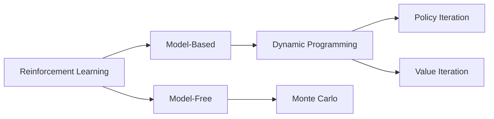

# Reinforcement Learning <br> (DSAI 402)
## Lecture 6

Mohamed Ghalwash
<Email v="mghalwash@zewailcity.edu.eg" />

---
transition: fade-out
layout: top-title
class: ns-c-center-item
---

:: title :: 

# Lecture 5 Recap

:: content :: 

- Value iteration algorithm 
- Issues in policy iteration and value iteration algorithms
- Model free concept


---
layout: top-title
---

:: title ::

# Model-free vs Model-based

:: content :: 

<br/><br/>




---
layout: top-title
---

:: title ::

# Model-free vs Model-based

:: content :: 

<div class="grid grid-cols-2 gap-4 w-full">
  <div>

# Model-based
  - Requires knowledge of the environment’s model (<em>transition and reward</em>) to evaluate and improve a policy systematically
  - Computes the value function using the known transition probabilities and reward function to solve the Bellman equations
  </div>
  <div>

# Model-Free
  - Methods without a model; they learn association between action and return
  - Approximates these expectations by averaging observed returns from sampled experience, not by using the transition matrix or reward model
  </div>
  <div class="col-span-2 text-center">


  </div>
</div>

---
layout: top-title 
---

:: title ::

# Monte Carlo Method

:: content :: 

- How to compute the value function [without knowing the model]{.decoration-4.underline.decoration-pink-500}?
  
$$
\sum_{s^\prime} p(s^\prime|s,a) \left[ r(s,a,s^\prime) + \gamma v_\pi(s^\prime) \right]
$$

- Requires only [experience]{.decoration-4.underline.decoration-indigo-500} — sample ==sequences of states, actions, and rewards== from actual or simulated interaction with an environment
- Estimates $q_\pi$ from [samples]{.bg-sky-200} under the policy $\pi$
- Relies on empirical returns from sampled episodes rather than explicit transition probabilities or reward models
- Averages returns for each state–action pair


---
layout: top-title 
---

:: title ::

# Monte Carlo Prediction - First Visit 

:: content :: 

- learning the state-value function

```python{1,2,3|6,7|9|10,11|12,13|14,15,16|all}
# Initialize value function V arbitrarily (e.g., all zeros)
V = defaultdict(float)
Returns = defaultdict(list)  # stores returns for each state

# Repeat for each episode
for episode in range(num_episodes):
    episode_data = generate_episode(...)  # generates [(state, reward), ...]

    G = 0  # return
    # Calculate the return G for each state in episode backwards
    for t in reversed(range(len(episode_data))):
        state, reward = episode_data[t]
        G = gamma * G + reward
        if state not in [x[0] for x in episode_data[:t]]:  # first visit check
            Returns[state].append(G)
            V[state] = sum(Returns[state]) / len(Returns[state])
```

<v-click>

The first-visit MC method estimates $v_\pi(s)$ as the average of the returns following first visits to $s$, whereas the every-visit MC method averages the returns following all visits to $s$.

</v-click>

---
layout: top-title
---

:: title :: 

# Monte Carlo Example 

:: content :: 

<div class ="ns-c-tight">

- Episode 1 = $S_0, 2, S_1, 5, S_0, 3, S_2, 1$
- Episode 2 = $S_1, 4, S_0, 1, S_2, 3$
- Episode 3 = $S_0, 4, S_0, 1, S_1, 2, S_0, 1, S_2, 2$

</div>

Assume $\gamma=1$ 


---
layout: top-title
---

:: title ::

# Monte Carlo Prediction: Iteration 1

:: content :: 

Episode 1:  
<span style="color:blue"> $S_0$, $2$, </span>
<span style="color:green"> $S_1$, $5$, </span>
<span style="color:blue"> $S_0$, $3$, </span>
<span style="color:red"> $S_2$, $1$</span>


| State | Return ($G$) | Value array before iteration $1$  |Value $v$ after iteration $1$  |
|-------|--------------|-------------------------|-----------------------------|
| <span style="color:blue">$S_0$</span> | <span v-click="1" style="color:blue">$9+2=11$</span> | <span v-click="1" style="color:blue;">$\{0\}$</span> | <span v-click="1" style="color:blue;">$11$</span>
| <span style="color:green">$S_1$</span> | <span v-click="2" style="color:green">$4+5=9$</span> | <span v-click="2" style="color:green;">$\{0\}$</span> | <span v-click="2" style="color:green;">$9$</span> 
| <span style="color:red">$S_2$</span> | <span v-click="3" style="color:red">$1$</span> | <span v-click="3" style="color:red;">$\{0\}$</span> | <span v-click="3" style="color:red;">$1$</span>


---
layout: top-title
---

:: title :: 

# Monte Carlo Prediction: Iteration 2

:: content :: 

Episode 2:  
<span style="color:green"> $S_1$, $4$, </span>
<span style="color:blue"> $S_0$, $1$, </span>
<span style="color:red"> $S_2$, $3$</span>


| State | Return ($G$) | Value array before iteration $2$  |Value $v$ after iteration $2$  |
|-------|--------------|-------------------------|-----------------------------|
| <span style="color:blue">$S_0$</span> | <span v-click="1" style="color:blue">$1+3=4$</span> | <span v-click="1" style="color:blue;">$\{11\}$</span>  | <span v-click="1" style="color:blue;">$(11 + 4)/2 = 7.5$</span> | 
| <span style="color:green">$S_1$</span> | <span v-click="2" style="color:green">$4+4=8$</span> | <span v-click="2" style="color:green;">$\{9\}$</span> | <span v-click="2" style="color:green;">$(9 + 8)/2 = 8.5$</span> | 
| <span style="color:red">$S_2$</span> | <span v-click="3" style="color:red">$3$</span> | <span v-click="3" style="color:red;">$\{1\}$</span> | <span v-click="3" style="color:red;">$(1 + 3)/2 = 2$</span> | 


---
layout: top-title
---

:: title :: 

# Monte Carlo Prediction: Iteration 3

:: content :: 

Episode 3:  

<span style="color:blue">$S_0$, $4$</span>,
<span style="color:blue">$S_0$, $1$</span>,
<span style="color:green">$S_1$, $2$</span>, 
<span style="color:blue">$S_0$, $1$</span>, 
<span style="color:red">$S_2$, $2$</span>


| State | Return ($G$) | Value array before iteration $3$  |Value $v$ after iteration $3$  |
|-------|--------------|-------------------------|-----------------------------|
| <span style="color:blue">$S_0$</span> | <span v-click="1" style="color:blue">$6+4=10$</span> | <span v-click="1" style="color:blue;">$\{11,4\}$</span> | <span v-click="1" style="color:blue;">$(11 + 4 + 10)/3 ≈ 8.33$</span>
| <span style="color:green">$S_1$</span> | <span v-click="2" style="color:green">$3+2=5$</span> | <span v-click="2" style="color:green;">$\{9,8\}$</span> | <span v-click="2" style="color:green;">$(9 + 8 + 5)/3 ≈ 7.33$</span>
| <span style="color:red">$S_2$</span> | <span v-click="3" style="color:red">$2$</span> | <span v-click="3" style="color:red;">$\{1,3\}$</span> | <span v-click="3" style="color:red;">$(1 + 3 + 2)/3 = 2$</span>


---
layout: fact
---

# Where is the policy? 

---
layout: top-title
---

:: title :: 

# How to Estimate $q(s,a)$?

:: content :: 

- With a model, state values alone are sufficient to determine a policy; one simply looks ahead one step and chooses whichever action leads to the best combination of reward and next state
- Without a model, state values alone are not sufficient to determine the policy, unlike model-based 

$$ \textcolor{blue}{s_0, a_0, r_0}, \textcolor{green}{s_1, a_1, r_1}, \textcolor{red}{s_2, a_2, r_2}, etc.$$

- One can consider each pair of state-action $(s,a)$ as a new state $k$ and apply the previous algorithm to find the stat-action value function $v_\pi(k) = q(s,a)$

Example: 
$$ \textcolor{blue}{s_0, RIGHT}, 4, \textcolor{green}{s_0, LEFT}, 1, \textcolor{purple}{s_1, DOWN}, 2, \textcolor{blue}{s_0, RIGHT}, 1, \textcolor{red}{s_2, UP}, 2$$
$$ \textcolor{blue}{k_0}, 4, \textcolor{green}{k_1}, 1, \textcolor{purple}{k_2}, 2, \textcolor{blue}{k_0}, 1, \textcolor{red}{k_2}, 2$$

---
layout: top-title 
---

:: title ::

# Summary and Practical Tips

:: content :: 

- Model-based vs Model-free 
  
- Monte Carlo Prediction -- estimates from experience 
  - First visit 
  - Every visit   

- Monte Carlo - Policy: estimate the action by considering a new state that combines state and action 

- Value Iteration: update the array immediately or after each iteration 

- We will get into a new problem of modeling only the observed actions. We need to *explore* other actions. 
  <!-- - exploring starts: every pair (state-action) has a nonzero probability of being selected as the start
  - $\epsilon-$greedy policy -->

---
layout: center
class: text-center
---

# Learn More

[Course Homepage](https://github.com/m-fakhry/DSAI-402-RL)
