# Reinforcement Learning <br> (DSAI 402)
## Lecture 7

Mohamed Ghalwash
<Email v="mghalwash@zewailcity.edu.eg" />

---
layout: fact
---

# Recording is NOT allowed 

---
transition: fade-out
layout: top-title
class: ns-c-center-item
---

:: title :: 

# Lecture 6 Recap

:: content :: 

- Monte-Carlo learns value functions or policies by sampling episodes under the current policy, starting from a fixed start state (or distribution)

- Monte-Carlo methods 
  - First-visit 
  - Every-visit


---
layout: top-title
---

:: title :: 

# Recap: How to Estimate $q(s,a)$?

:: content :: 

- In model-free, state values alone are not sufficient to determine the policy, unlike model-based 

$$ \textcolor{blue}{s_0, a_0, r_0}, \textcolor{green}{s_1, a_1, r_1}, \textcolor{red}{s_2, a_2, r_2}, etc.$$

- One can consider each pair of state-action $(s,a)$ as a new state $k$ and apply the MC algorithm to find the state-action value function $v_\pi(k) = q(s,a)$

Example: 
$$ \textcolor{blue}{s_0, R}, 4, \textcolor{green}{s_0, L}, 1, \textcolor{purple}{s_1, D}, 2, \textcolor{blue}{s_0, R}, 1, \textcolor{red}{s_2, U}, 2$$
$$ \textcolor{blue}{k_0}, 4, \textcolor{green}{k_1}, 1, \textcolor{purple}{k_2}, 2, \textcolor{blue}{k_0}, 1, \textcolor{red}{k_2}, 2$$

==MC can suffer from incomplete exploration if some states or state-action pairs are not visited under the current policy==

---
layout: "section"
---

### We will get into a new problem of modeling only the observed actions. We need to *EXPLORE* other actions

---
layout: top-title 
---

:: title ::

# MC with Exploring starts

:: content ::

- Starting every episode from a **randomly** chosen state-action pair (exploring start)

- Every pair (state-action) has a nonzero probability of being selected as the **start** 


```python{0|6,7|all}
V = defaultdict(float)
Returns = defaultdict(list)  # stores returns for each state

# Loop over all episodes
for episode in range(num_episodes):
    start_state = random.choice(all_states)           # Exploring start state
    start_action = random.choice(actions_for(start_state))  # Exploring start action
    
    episode_data = generate_episode(...)

    G = 0  # return
    # Calculate the return G for each state in episode backwards
    for t in reversed(range(len(episode_data))):
        state, action, reward = episode_data[t]
        G = gamma * G + reward
        if state not in visited_states:                # first-visit check
            Returns[state].append(G)
            V[state] = sum(Returns[state]) / len(Returns[state])
```


---
layout: top-title 
---

:: title ::

# $\epsilon$-greedy MC

:: content ::

- Continuous exploration:
  Instead of randomizing the **initial** state-action for each episode, $\epsilon$-greedy MC incorporates exploration during the episode by selecting **at each step** a random action with probability $\epsilon$ and the greedy action otherwise


```python{0|3,7,17|all}
V = defaultdict(float)
Returns = defaultdict(list)  # stores returns for each state
Initialize an arbitrary policy 

# Loop over all episodes
for episode in range(num_episodes):    
    episode_data = generate_episode(epsilon, ...)

    G = 0  # return
    # Calculate the return G for each state in episode backwards
    for t in reversed(range(len(episode_data))):
        state, action, reward = episode_data[t]
        G = gamma * G + reward
        if state not in visited_states:                # first-visit check
            Returns[state].append(G)
            V[state] = sum(Returns[state]) / len(Returns[state])
            Update the policy
```

---
layout: top-title 
---

:: title ::

# $\epsilon$-greedy MC

:: content ::

- Issues
  - May require careful tuning of $\epsilon$ 
  - May not guarantee uniform coverage of all state-action pairs as explicitly as exploring starts

---
layout: cover
--- 

# Temporal Difference 

"If one had to identify one idea as central and novel to reinforcement learning, it would
undoubtedly be temporal-difference (TD) learning", Richard Sutton


---
layout: top-title
---

:: title ::

# Temporal Difference (TD) Learning 

:: content :: 

Before going deep into TD, most of the RL algorithms loop over two steps: 
- policy evaluation (aka prediction) 
- policy improvement (aka control)

The key distinction among these methods is their approach to **policy evaluation**

---
layout: top-title
---

:: title :: 

# What is Temporal Difference (TD)? 

:: content :: 

It is a mix between Monte Carlo and Dynamic Programming 

- It can learn directly from raw experience without a model of the environment’s dynamics

- It updates estimates based in part on other learned estimates, without waiting for a final outcome (they bootstrap)

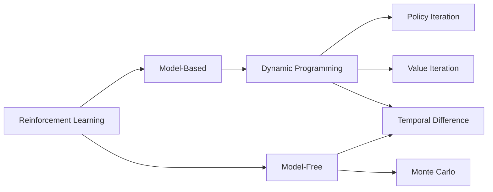

--- 
layout: top-title-two-cols
---

:: title ::

# MC Example 

:: left :: 

Grid world $4\times 4$
<v-click>

- Start state = $1$
- Terminal state = $16$
- Episode = \[$1, 2, 6, 10, 14, 15, 16$\]
- $\gamma=1$ 
</v-click>  

:: right :: 

<v-switch>

  <template #1> 
<div>
  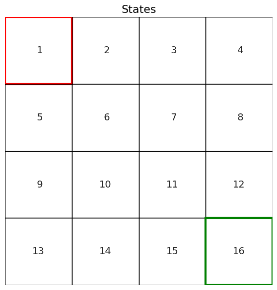
</div>
  </template>

  <template #2> 
<div>
  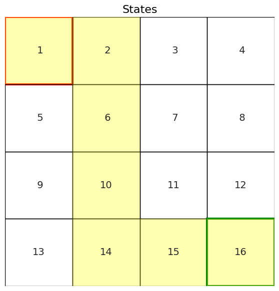
</div>
  </template>

  <template #3> 
<div>
  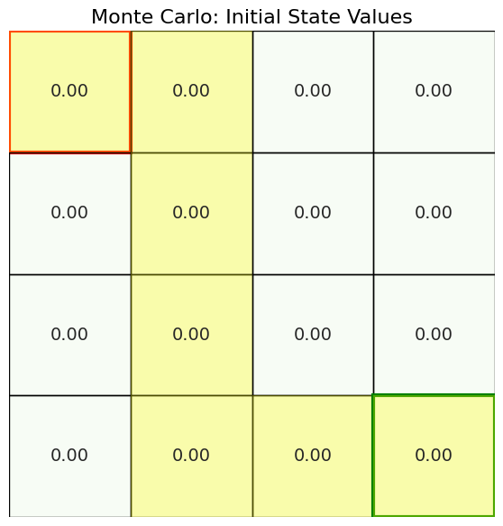
</div>
  </template>

  <template #4> 
<div>
  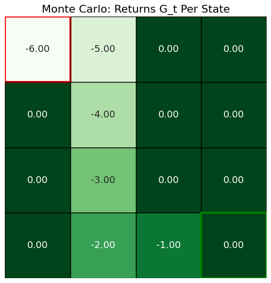
</div>
  </template>

  <template #5> 
<div>
  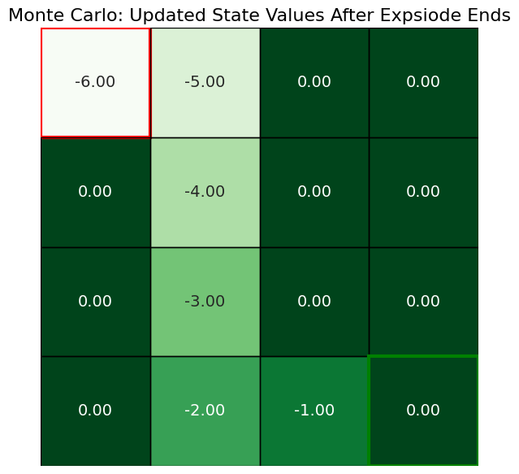
</div>
  </template>

</v-switch>


--- 
layout: top-title-two-cols
---

:: title ::

# Example 

:: left :: 

$$
V(S_t) \leftarrow V(S_t) + \alpha \left[ R_{t+1} + \gamma V(S_{t+1}) - V(S_t) \right]
$$


<v-click>

- States arranged in a grid
- Agent moves through states, receiving rewards
- Initial value estimates $V(s) = 0$
- Value updated step-by-step using TD rule
- $\alpha=0.5$

</v-click>  

<!-- <v-click>

- $V(S_t)$ updated based on immediate reward + estimate of next state’s value
- Learning propagates backward gradually through prior visited states
</v-click>   -->

:: right :: 

<v-switch>
  <template #1> 
<div>
  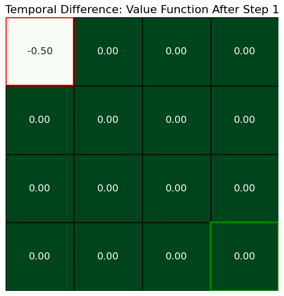
</div>
  </template>

  <template #2> 
<div>
  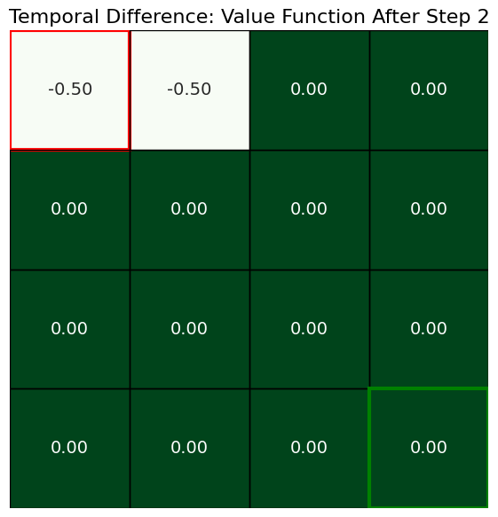
</div>
  </template>

  <template #3> 
<div>
  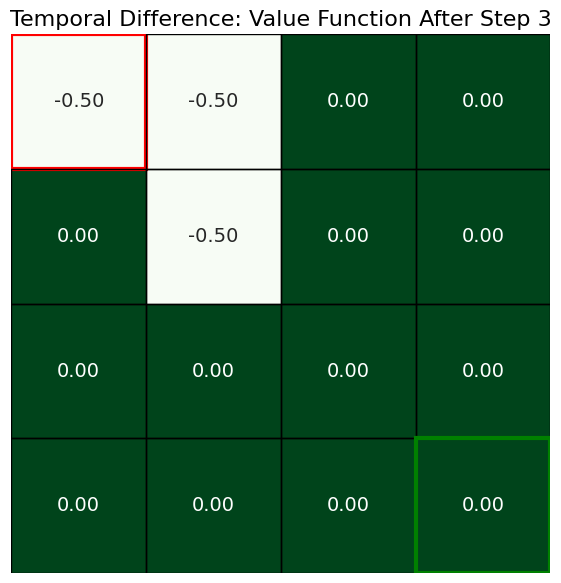
</div>
  </template>

  <template #4> 
<div>
  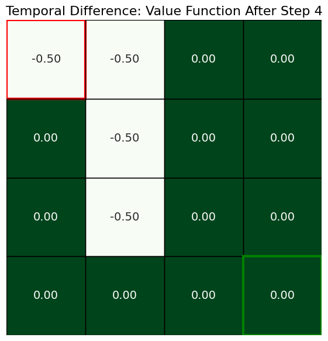
</div>
  </template>

  <template #5> 
<div>
  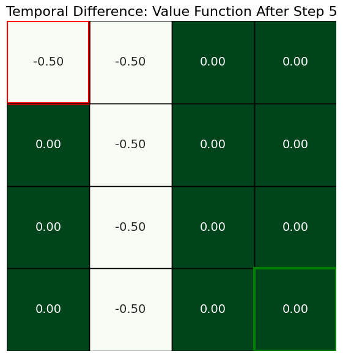
</div>
  </template>

  <template #6> 
<div>
  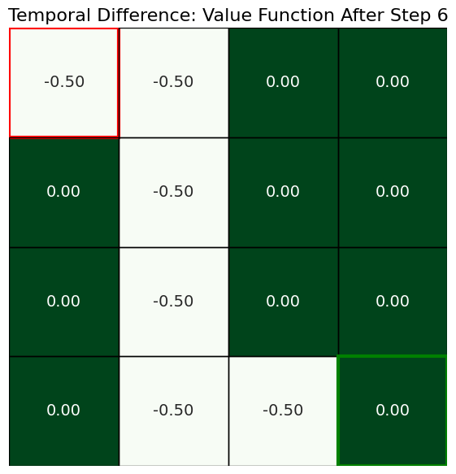
</div>
  </template>

</v-switch>

---
layout: center
class: text-center
---

# Learn More

[Course Homepage](https://github.com/m-fakhry/DSAI-402-RL)
