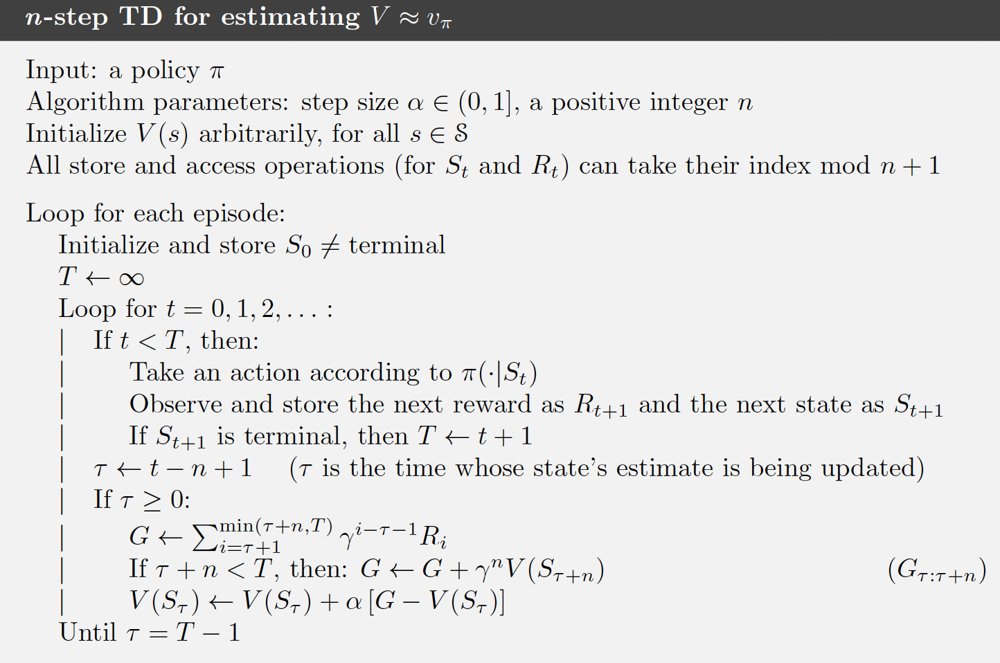
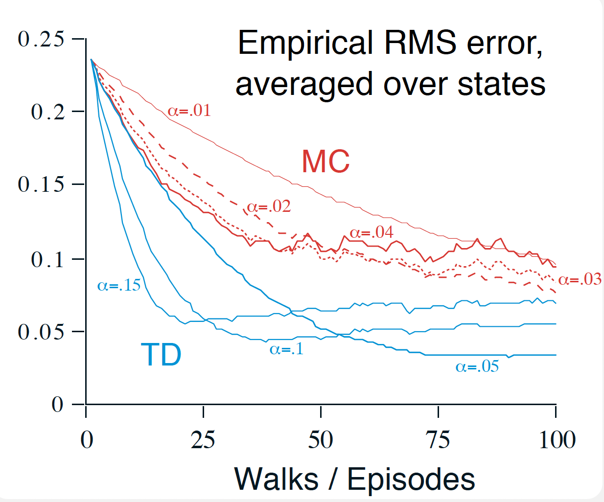
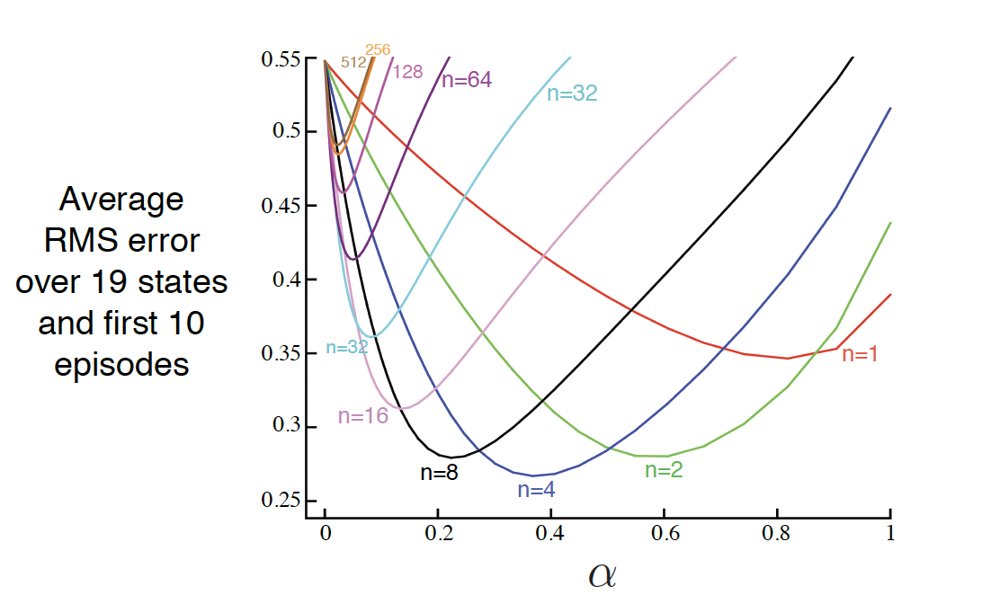

# Reinforcement Learning   (DSAI 402)
## Lecture 8

Mohamed Ghalwash
<Email v="mghalwash@zewailcity.edu.eg" />

---
layout: fact
---

# Recording is NOT allowed 

---
transition: fade-out
layout: top-title
class: ns-c-center-item
---

:: title :: 

# Lecture 7 Recap

:: content :: 

- Model-based
  - Policy Iteration
  - Value Iteration 

- Model-free 
  - MC
  - MC with Exploring start 
  - $\epsilon$-greedy MC
  - TD Learning 
  
--- 
layout: top-title
---
:: title ::

# What is TD Learning?

:: content :: 

$$
v(s_t) = v(s_t) + \alpha \left[ \textcolor{red}{R_{t+1} + \gamma v(s_{t+1})} - v(s_t) \right]
$$

$\alpha$ is the learning rate

<v-click>

- TD Error: $\delta_t = R_{t+1} + \gamma v(s_{t+1}) - v(s_t)$
- Measures the difference between actual and estimated returns
- Used to adjust $v(s_t)$ closer to true expected future rewards
- Combines ideas from **Monte Carlo** and **Dynamic Programming**
- Updates estimates **at each step**, not waiting for episode end
<!-- - Learns the **value function** $v(s)$ of states directly -->
- Model-free reinforcement learning method

</v-click>

--- 
layout: top-title
---

:: title ::

# Comparison 

:: content :: 

$${0|1|1,2,3|1,2,3,4,5|all}
\begin{array}{rlll}
\text{TD} & \Rightarrow \qquad & 
v(s_t) & = v(s_t) + \alpha \left[ \textcolor{red}{R_{t+1} + \gamma v(s_{t+1})} - v(s_t) \right]\\
&&&&\\
\text{MC} & \Rightarrow \qquad & 
v_(s_t) & = \mathbb{E} \left[ \textcolor{red}{R_{t+1} + \gamma G_{t+1}} \mid S_t = s \right] 
\\
&&&&\\
\text{Value Iteration} & \Rightarrow \qquad & 
v_\pi(s)  & = \max_a \sum_{s^\prime} p(s^\prime|s,a) \textcolor{red}{\left[ r(s,a,s^\prime) + \gamma v_\pi(s^\prime) \right]} 
\\
&&&&\\
\text{Policy Evaluation} & \Rightarrow \qquad & 
v_\pi(s)  & = \sum_a \pi(a|s) \sum_{s^\prime} p(s^\prime|s,a) \textcolor{red}{\left[ r(s,a,s^\prime) + \gamma v_\pi(s^\prime) \right]} 
\\
\end{array}
$$

--- 
layout: top-title
---

:: title ::

# Why TD Learning?

:: content :: 

- Can learn **online**: updates immediately at every step
- Does not require knowledge of the full episode
- Often faster and more data-efficient than Monte Carlo methods

---
layout: statement 
--- 

# Have you done the TD assignment? 

---
layout: image
image: ./images/TD_1.png
---

---
layout: top-title
--- 

:: title :: 

# $n$-step TD 

:: content :: 

One kind of intermediate method that would perform an update based on an intermediate number of rewards: more than one, but less than all of them until termination

$$
\begin{array}{ll}
v(s_t) & = v(s_t) + \alpha \left[ \textcolor{red}{R_{t+1} + \gamma v(s_{t+1})} - v(s_t) \right]\\
& = v(s_t) + \alpha \left[ \textcolor{red}{G_{t:t+1}} - v(s_t) \right]
\end{array}
$$

$${0|1|1,2,3|all}
\begin{array}{rlll}
\text{1-step TD} & \Rightarrow \qquad & 
G_{t:t+1} & = R_{t+1} + \gamma v(s_{t+1})\\\\
\text{2-step TD} & \Rightarrow \qquad & 
G_{t:t+2} & = R_{t+1} + \gamma R_{t+2} + \gamma^2 v(s_{t+2})\\\\
\\
&&&&\\
\text{$n$-step TD} & \Rightarrow \qquad & 
G_{t:t+n} & = R_{t+1} + \gamma R_{t+2} + \ldots + \gamma^n v(s_{t+n})\\\\
\end{array}
$$
<v-click>

Then the update rule becomes 
$v(s_t) = v(s_t) + \alpha \left[ \textcolor{red}{G_{t:t+n}} - v(s_t) \right]$ 
</v-click>

---
layout: image
image: ./images/TD_2.png
---

---
layout: top-title
---

:: title :: 

# Algorithm 

:: content :: 

{width=70%;margin=auto}

---
layout: top-title-two-cols
columns: is-4
--- 

:: title :: 

# Evaluate the Performance of a Model-Free Algorithm

:: right :: 

<v-switch>

  <template #1> 

  

  </template>

  <template #2> 

  

  </template>

  <template #3> 

  

  </template>

  <template #4> 

  

  </template>

</v-switch>

:: left :: 

**Random Walk Example**
<!-- - Compute the error between the estimated value and the true value -->
- For each episode
  - update the value and compute the error (loss) 
<!-- - Plot error (loss) vs episode (epochs)  -->
- Average across multiple runs 
- Run for different $\alpha$ and $n$ 
<!-- - Check which one converge faster?  -->
<!-- - Study the effect of $\alpha$ 
- Study the effect of $n$  -->

---
layout: center
class: text-center
---

# Learn More

[Course Homepage](https://github.com/m-fakhry/DSAI-402-RL)
