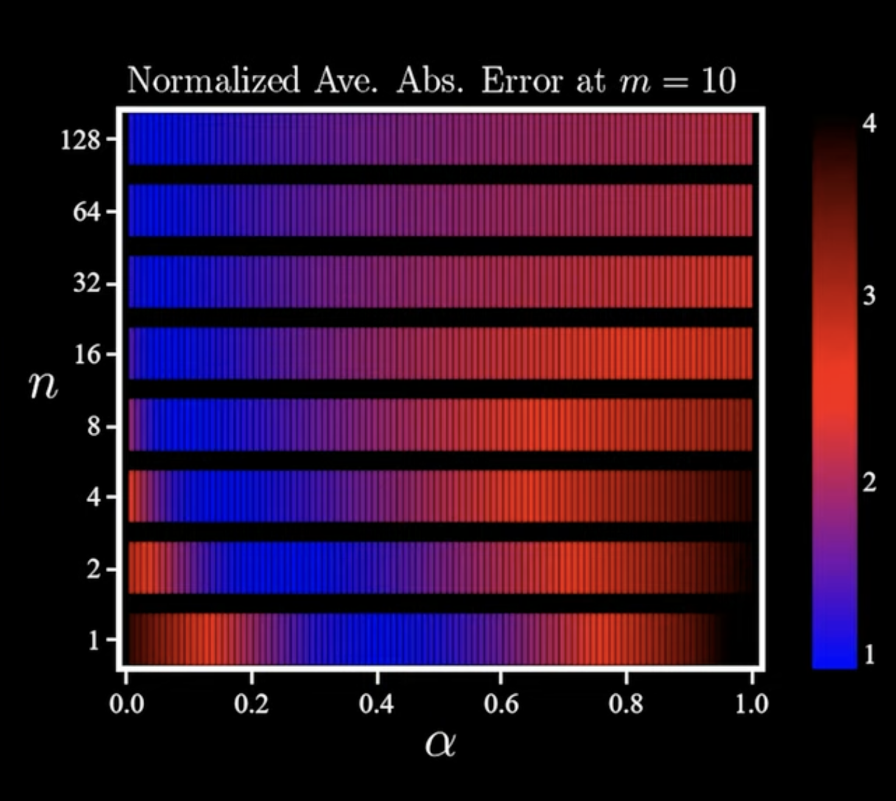
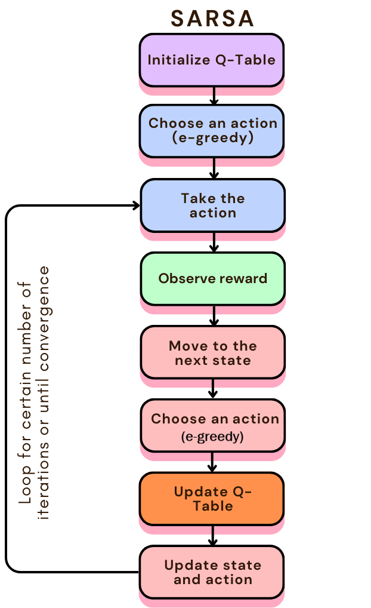
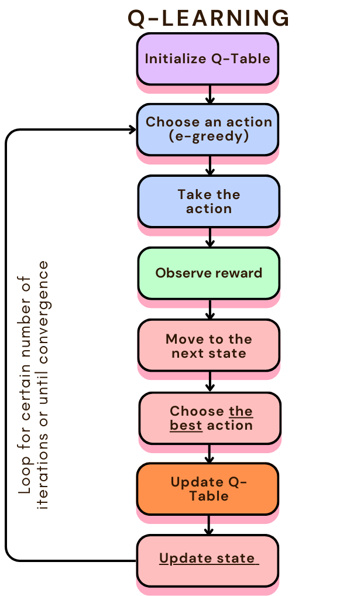

# Reinforcement Learning   (DSAI 402)
## Lecture 9

Mohamed Ghalwash
<Email v="mghalwash@zewailcity.edu.eg" />

---
layout: fact
---

# Recording is NOT allowed 

---
transition: fade-out
layout: top-title-two-cols
class: ns-c-center-item
columns: is-8
---

:: title :: 

# Lecture 8 Recap

:: right :: 

  

:: left :: 

- TD Learning
  - TD(0)
  
    $v(s_t) = v(s_t) + \alpha \left[ R_{t+1} + \gamma v(s_{t+1}) - v(s_t) \right]$

  - $n$-step TD
    
    $v(s_t) = v(s_t) + \alpha \left[G_{t:t+n} - v(s_t) \right]$ 

    $G_{t:t+n} = R_{t+1} + \gamma R_{t+2} + \ldots + \gamma^n v(s_{t+n})$
  

- Prediction (*policy evaluation*) vs Control (*finding an optimal policy*)

--- 
layout: top-title 
--- 

:: title :: 

# SARSA: On-policy TD Control

:: content :: 

<v-clicks> 

- Control $\Rightarrow$ estimate the [action value]{.bg-indigo-200} function $q$ not the [state value]{.bg-indigo-200} function $v$
  
  $$
  q(s_t, a_t) = q(s_t, a_t) + \alpha \left[ R_{t+1} + \gamma q(s_{t+1}, a_{t+1}) - q(s_t, a_t) \right]
  $$

  *at state $s_t$, [take action]{.decoration-4.underline.decoration-pink-500} $a_t$ (using the $\epsilon$-greedy policy), observe reward $R_{t+1}$, move to next state $s_{t+1}$, and [choose action]{.decoration-4.underline.decoration-pink-500} $a_{t+1}$*

- State, Action, Reward, State, Action (SARSA)

- The agent selects an action in a given state, observes the resulting reward and next state, and updates its strategy according to the outcome—whether positive or negative. By repeating this process over many iterations, the agent gradually improves its decision-making abilities

</v-clicks> 

--- 
layout: top-title-two-cols
columns: is-8
--- 

:: title :: 

# SARSA: On-policy TD Control

:: right :: 

    

:: left :: 

- SARSA learns from the actual actions taken by the agent, even during exploration. This makes it especially valuable when the process of learning—such as trying out new strategies—is as important as achieving the final outcome

- When the agent explores and takes a risky action, SARSA observes the negative outcome (such as a large penalty) and updates its Q-value for that action to reflect the risk. Over time, the agent learns that such actions lead to poor results and thus avoids them. Hence, it favors safer and conservative alternatives

---
layout: statement
--- 

# Example

<!-- - Initialize Q-table
- Parameters: $\alpha$, $\gamma$, $\epsilon$, $N$ 
- Objective: The agent’s goal is to collect as much reward as possible in the shortest time possible
- $\epsilon$-greedy action (exploration and exploitation)
  - This approach allows the agent to discover new, potentially better strategies while also using what it has already learned. -->

--- 
layout: statement
--- 

## I still do not know what "on-policy" means 😢

 

<v-click>

### Just be patient! 

</v-click> 

--- 
layout: statement
--- 

## Now we know SARSA 

$$ q(s_t, a_t) = q(s_t, a_t) + \alpha \left[ R_{t+1} + \gamma q(s_{t+1}, a_{t+1}) - q(s_t, a_t) \right]$$

<v-click>

[What would be the equation for n-step SARSA?]{.decoration-4.underline.decoration-red-500.bg-red-200}

</v-click> 

    

<v-click>

You're smart enough to figure it out yourself 😜

</v-click> 

---
layout: cover
--- 

# Q-Learning

--- 
layout: top-title-two-cols
columns: is-8
--- 

:: title :: 

# Q-Learning: Off-policy TD Control

:: left :: 

<v-click> 

$$
  q(s_t, a_t) = q(s_t, a_t) + \alpha \left[ R_{t+1} + \gamma \max_{a}q(s_{t+1}, a) - q(s_t, a_t) \right]
$$

</v-click> 

<v-click> 

*at state $s_t$, [take action]{.decoration-4.underline.decoration-pink-500} $a_t$ (using the $\epsilon$-greedy policy), observe reward $R_{t+1}$, move to next state $s_{t+1}$*

</v-click> 

:: right :: 

<v-click> 

    

</v-click>

--- 
layout: top-title-two-cols
columns: is-4
--- 

:: title :: 

# Q-Learning: Off-policy TD Control

:: left :: 

    

:: right :: 

<v-clicks> 

- Q-learning learns from the maximum possible reward, even if the agent didn’t actually follow that path during training

- Q-learning always assumes that the agent will take the optimal action in the future, even if it is riskier, and is therefore more aggressive
  
- The policy for taking an action and updating the value function is different
  - $\epsilon$-greedy policy is the acting policy, and the greedy policy is the updating policy
  
  
</v-clicks> 

--- 
layout: top-title-two-cols
columns: is-6
--- 

:: title :: 

# SARSA vs Q-Learning

:: left :: 

    

:: right :: 

    

--- 
layout: top-title 
--- 

:: title :: 

# What is on-policy and off-policy?

:: content :: 

<v-clicks>

- On-policy 
  - uses the same strategy for both the behaviour and target policy 
  - algorithm evaluates and improves the same policy used to take an action

- Off-policy 
  - algorithms use a different strategy for the behaviour and target policy
  - the algorithm evaluates and updates a policy that differs from the policy used to take an action
  
</v-clicks>

---
layout: center
class: text-center
---

# Learn More

[Course Homepage](https://github.com/m-fakhry/DSAI-402-RL)

<!-- https://www.datacamp.com/tutorial/sarsa-reinforcement-learning-algorithm-in-python -->